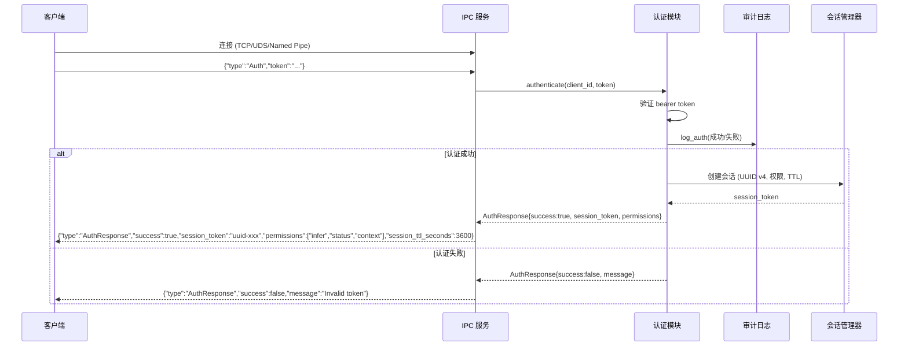
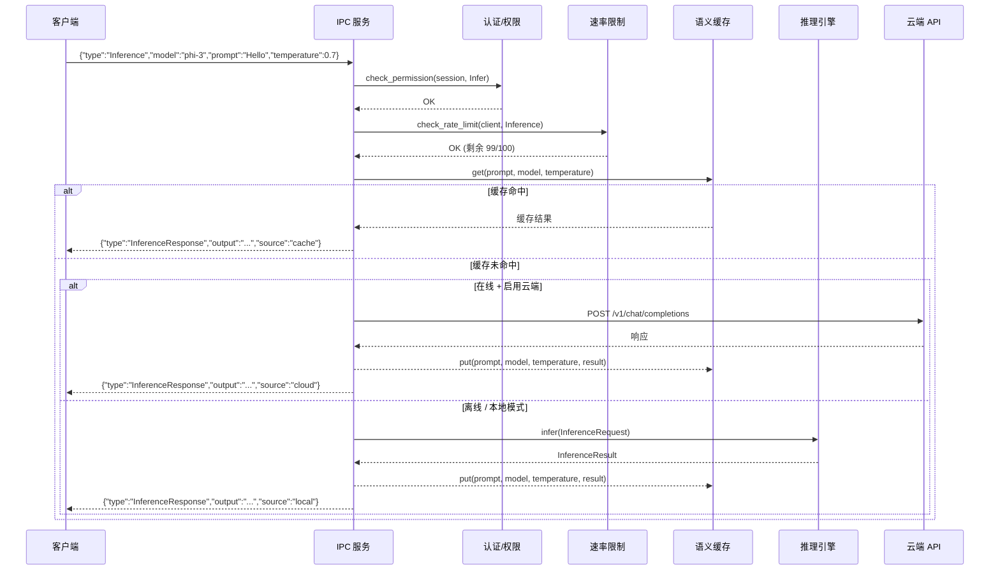
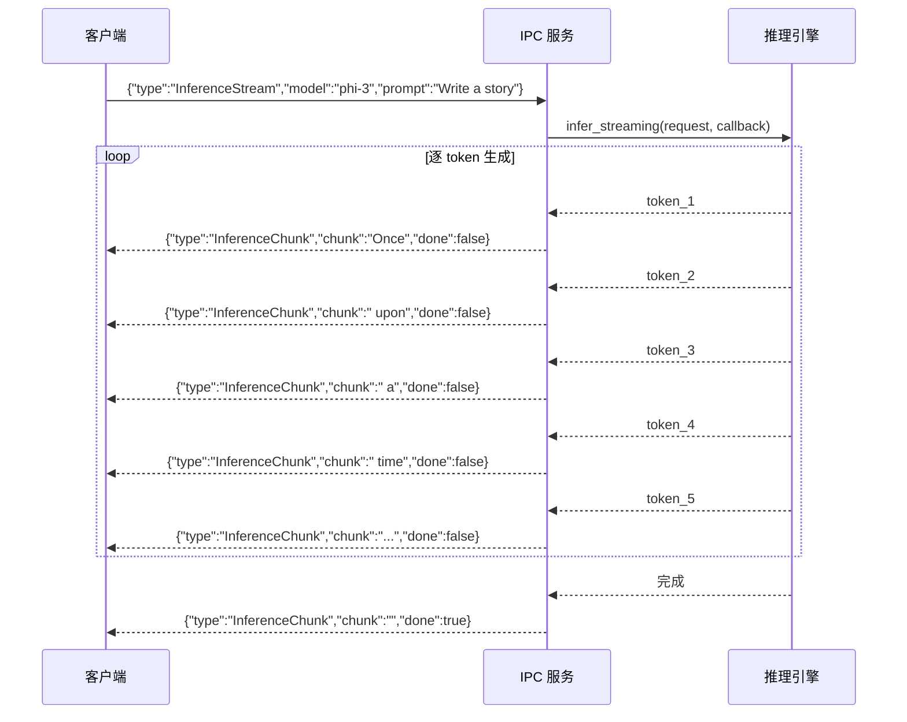
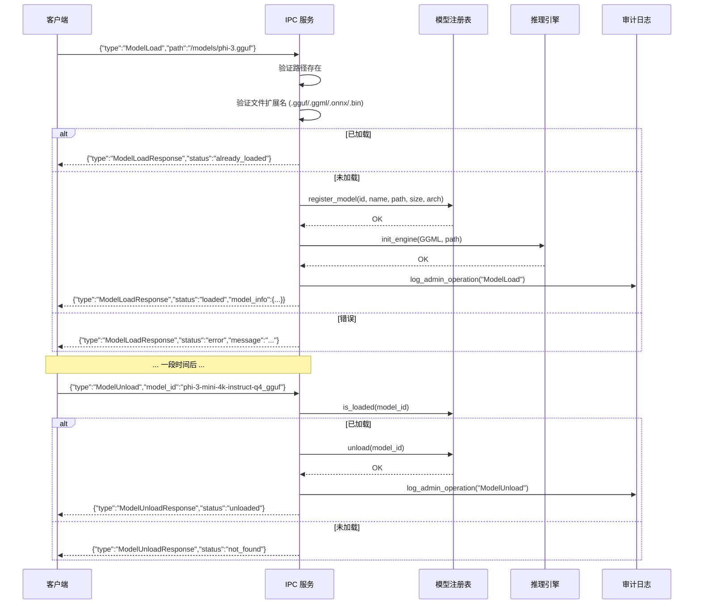
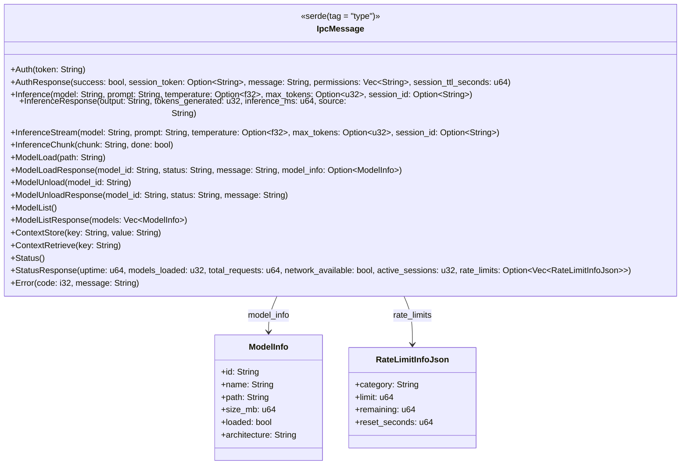
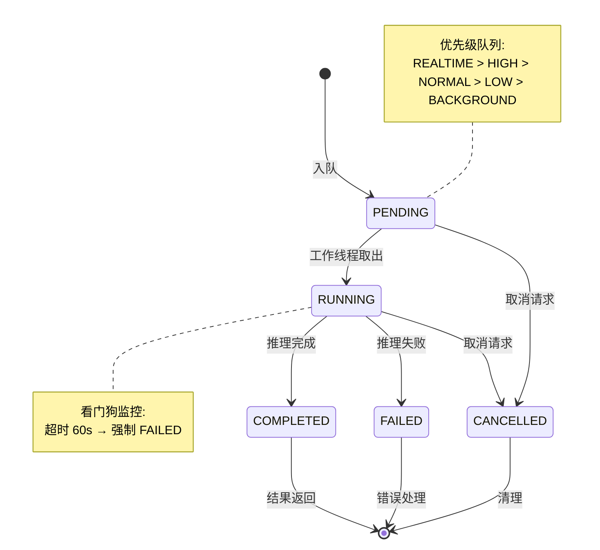
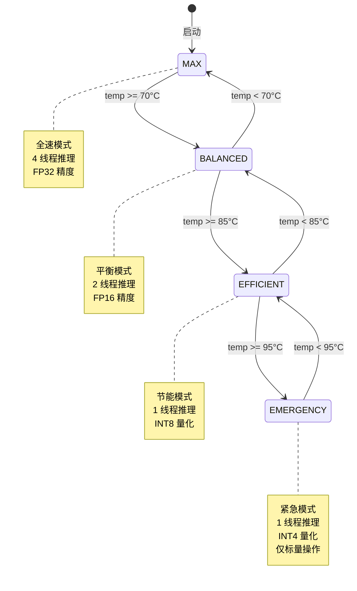

# AinosOS 系统架构概述

> **文档版本:** v1.0.0  
> **最后更新:** 2026-08-04  
> **代码仓库:** `D:/Ainos`  
> **许可证:** GPL-2.0-only / MIT  

---

## 目录

1. [系统架构概述](#1-系统架构概述)
2. [内核子系统设计](#2-内核子系统设计)
3. [系统服务架构](#3-系统服务架构)
4. [IPC 协议设计](#4-ipc-协议设计)
5. [安全模型](#5-安全模型)
6. [部署架构](#6-部署架构)
7. [图表与可视化](#7-图表与可视化)

---

## 1. 系统架构概述

### 1.1 设计理念

AinosOS 是一个 **AI 原生操作系统**——将 AI 推理能力深度集成到操作系统的每一层，从内核调度到系统服务再到用户空间 SDK。AI 不再是"运行在 OS 上的应用"，而是"作为系统基础设施"存在。

核心理念：

- **AI as Infrastructure** — AI 是系统的基础设施，操作系统提供系统调用、设备文件、守护进程等原生接口
- **Offline-First** — 优先本地推理，云端作为回退；网络断开时核心功能不受影响
- **Thermal-Aware** — 温度感知的电源策略调度，避免 AI 推理导致设备过热
- **Cross-Platform** — 同一套架构覆盖 Linux、Windows、macOS
- **Security by Design** — 从内核到 IPC 的端到端安全设计

### 1.2 四层架构总览

```
 ┌─────────────────────────────────────────────────────────────────────────┐
 │                          USER SPACE (用户空间)                           │
 │                                                                         │
 │  ┌────────────────┐  ┌──────────────────┐  ┌────────────────────────┐  │
 │  │  User Apps     │  │  Userland Tools  │  │  SDK / Bindings        │  │
 │  │  (third-party) │  │  ai-git, ai-     │  │  Python / Rust / Go /  │  │
 │  │                 │  │  code-review,    │  │  Java / C# / Node.js   │  │
 │  │                 │  │  ai-doc-gen,     │  │   (TCP IPC)            │  │
 │  │                 │  │  ai-test-gen     │  │                         │  │
 │  └────────┬────────┘  └────────┬─────────┘  └───────────┬─────────────┘  │
 │           │                    │                         │               │
 │           │                    │                         │               │
 │           ▼                    ▼                         ▼               │
 │  ┌──────────────────────────────────────────────────────────────────┐   │
 │  │                  AI DAEMON (ai-daemon)                           │   │
 │  │  ┌──────────┐ ┌───────┐ ┌──────────┐ ┌─────────┐ ┌───────────┐ │   │
 │  │  │ IPC 服务  │ │ 推理   │ │ 上下文    │ │ 语义     │ │ 认证/限流  │ │   │
 │  │  │ TCP/UDS  │ │ 路由   │ │ 管理者    │ │ 缓存     │ │ 会话/权限  │ │   │
 │  │  │ Named    │ │ local │ │ SQLite   │ │ LRU     │ │ Token     │ │   │
 │  │  │ Pipe     │ │ cloud  │ │ persist  │ │ 1000    │ │ Bucket    │ │   │
 │  │  └──────────┘ └───────┘ └──────────┘ └─────────┘ └───────────┘ │   │
 │  └──────────────────────────┬───────────────────────────────────────┘   │
 │                              │                                          │
 └──────────────────────────────┼──────────────────────────────────────────┘
                                │
 ┌──────────────────────────────┼──────────────────────────────────────────┐
 │                   AI RUNTIME (AI 运行时层)                               │
 │                                                                         │
 │  ┌──────────────────────────────────────────────────────────────────┐   │
 │  │  ┌───────────────┐  ┌──────────────┐  ┌──────────────────────┐  │   │
 │  │  │  GGML Engine  │  │  ONNX        │  │  Power Policy        │  │   │
 │  │  │  (本地推理)    │  │  Service     │  │  Thermal Monitor     │  │   │
 │  │  │  llama.cpp    │  │  (云端回退)   │  │  Adaptive Polling    │  │   │
 │  │  └───────────────┘  └──────────────┘  │  0.5s-10s 动态间隔    │  │   │
 │  │                                       └──────────────────────┘  │   │
 │  │  ┌───────────────┐  ┌──────────────┐                            │   │
 │  │  │  Context      │  │  Model       │                            │   │
 │  │  │  Manager      │  │  Manager     │                            │   │
 │  │  └───────────────┘  └──────────────┘                            │   │
 │  └──────────────────────────────────────────────────────────────────┘   │
 │                              │                                           │
 └──────────────────────────────┼───────────────────────────────────────────┘
                                │
 ┌──────────────────────────────┼───────────────────────────────────────────┐
 │                        KERNEL LAYER (内核层)                             │
 │                                                                         │
 │  ┌──────────────┐  ┌──────────────┐  ┌──────────────┐  ┌─────────────┐ │
 │  │ AI Scheduler │  │ AI Syscalls │  │ Vector Accel │  │ AI KILL     │ │
 │  │ 5优先级队列   │  │ 450-457      │  │ AVX2/AVX-512 │  │ 7维度评分    │ │
 │  │ 4工作线程     │  │ /dev/ainos   │  │ AMX/NEON/SVE│  │ 智能进程终止 │ │
 │  │ 看门狗        │  │ IOCTL       │  │ 运行时检测   │  │ /proc/ai-kill│ │
 │  └──────────────┘  └──────────────┘  └──────────────┘  └─────────────┘ │
 │                                                                         │
 │  ┌──────────────┐  ┌──────────────┐  ┌──────────────┐  ┌─────────────┐ │
 │  │ AI tmpfs     │  │ AI Readahead │  │ Self-Heal   │  │ Hotpatch    │ │
 │  │ 智能文件缓存  │  │ 智能预读     │  │ 5级恢复     │  │ 内核函数补丁 │ │
 │  │ 热/温/冷分类  │  │ 模式分析器   │  │ LOG→KEXEC   │  │ JMP rel32   │ │
 │  │ LRU+Shrinker │  │ 顺序/步长检测 │  │ /proc/self- │  │ stop_machine│ │
 │  │              │  │             │  │ heal        │  │ /proc/ai-   │ │
 │  │              │  │             │  │             │  │ hotpatch    │ │
 │  └──────────────┘  └──────────────┘  └──────────────┘  └─────────────┘ │
 │                                                                         │
 │  ┌──────────────────────────────────────────────────────────────────┐   │
 │  │  /proc/ai 虚拟文件系统 (proc_ai.c)                                │   │
 │  │  status | infer | embed | chat | models | config | stats         │   │
 │  └──────────────────────────────────────────────────────────────────┘   │
 └─────────────────────────────────────────────────────────────────────────┘
```

### 1.3 设计原则

| 原则 | 说明 | 实现方式 |
|------|------|----------|
| **AI 作为基础设施** | AI 推理是 OS 的第一等公民 | 8 个专用系统调用 (450-457)、/dev/ainos 设备、/proc/ai 文件系统 |
| **离线优先** | 无网络时核心功能不受影响 | 本地 GGML 引擎 + 云端回退、网络检测自动切换 |
| **温度感知** | 避免过热，自适应降级 | 内核热监控 + 用户态自适应轮询 (0.5s-10s) |
| **跨平台** | 同一系统覆盖三大平台 | Rust 核心 + 平台特定模块 (systemd/launchd/Windows Service) |
| **安全设计** | 从内核到 IPC 端到端安全 | 内核态权限检查 + 用户态 Token 认证 + TLS 加密 + 审计日志 |

### 1.4 与常规操作系统对比

| 特性 | 常规 OS | AinosOS |
|------|---------|---------|
| 系统调用 | ~450 个 (Linux) | +8 个 AI 专用 syscall (450-457) |
| 进程调度 | 基于优先级/时间片 | +AI 推理任务调度 (5 级优先级队列) |
| 文件系统 | ext4/btrfs/tmpfs | +AI tmpfs (智能缓存分类) |
| 预读 | readahead (顺序模式) | +AI Readahead (顺序/步长/随机检测) |
| 进程终止 | OOM Killer | +AI KILL (7 维度评分) |
| 系统恢复 | kdump/panic | +Self-Heal (5 级渐变恢复) |
| 内核修补 | kpatch/kgraft | +Hotpatch (JMP rel32 指令级) |
| 进程通信 | D-Bus/Unix sockets | +AI IPC (JSON over TCP/UDS/Named Pipe) |
| 系统监控 | top/htop | +/proc/ai 虚拟文件系统 |

---

## 2. 内核子系统设计

### 2.1 AI 调度器 (ai-scheduler-main.c)

AI 调度器管理 AI 推理任务的优先级排队和执行。

**源文件:** `D:/Ainos/kernel/ai-scheduler-main.c`

#### 2.1.1 5 级优先级队列

```
 优先级         容量      用途
 ─────────────────────────────────────
 REALTIME (4)    64   系统服务，最高优先级
 HIGH (3)       256   用户交互任务
 NORMAL (2)     512   普通推理任务
 LOW (1)       1024   批处理任务
 BACKGROUND (0) 2048  后台分析任务
 
 调度策略: 严格优先级抢占 (从高到低遍历)
 队列满: pr_warn + 返回 -AI_ERR_TASK_QUEUE_FULL
```

#### 2.1.2 4 工作线程池

```c
#define AI_SCHED_THREAD_POOL 4  // 工作线程数

struct ai_worker {
    struct task_struct *thread;  // 内核线程
    int id;                      // 线程 ID
    struct ai_task *current_task;// 当前执行的任务
    atomic_t busy;               // 忙标志
};
```

#### 2.1.3 看门狗

- 间隔: `AI_SCHED_WATCHDOG_MS = 1000ms`
- 功能: 检查所有运行中的任务是否超时（单任务最大运行时间 60s）
- 超时处理: 标记失败，完成异步任务，释放资源

#### 2.1.4 温度感知电源策略

```
温度区间          模式        线程数
──────────────────────────────────────────
< 70°C            MAX         4 线程
70-85°C           BALANCED    2 线程
85-95°C           EFFICIENT   1 线程
> 95°C            EMERGENCY   1 线程 (降频)

读取: /sys/class/thermal/thermal_zone0/temp
轮询间隔: 2s
```

#### 2.1.5 任务跟踪表

```c
#define AI_TASK_TRACK_SIZE 2048

// 用于异步任务查询
// 支持 2048 个并发异步任务
// 满时循环覆盖最早的记录
```

### 2.2 AI 系统调用 (ai-syscalls-main.c)

**源文件:** `D:/Ainos/kernel/ai-syscalls-main.c`  
**ABI 定义:** `D:/Ainos/kernel/include/ainos/ai-abi.h`

#### 2.2.1 系统调用号分配

| 编号 | 名称 | 功能描述 | 参数 |
|------|------|---------|------|
| 450 | `sys_ai_inference` | AI 推理请求 | `struct ai_inference_req`, `struct ai_inference_resp` |
| 451 | `sys_ai_embedding` | 文本嵌入向量计算 | `struct ai_embedding_req` |
| 452 | `sys_ai_semantic_search` | 语义搜索（余弦相似度） | `struct ai_search_req` |
| 453 | `sys_ai_model_load` | 加载模型到内核 | `struct ai_model_load_req`, `model_id` |
| 454 | `sys_ai_model_unload` | 卸载模型 | `model_id` |
| 455 | `sys_ai_context_store` | 存储上下文（支持 TTL） | `struct ai_context_store_req`, `entry_id` |
| 456 | `sys_ai_context_retrieve` | 检索上下文 | `struct ai_context_retrieve_req` |
| 457 | `sys_ai_status` | 获取 AI 子系统状态 | `struct ai_system_status` |

#### 2.2.2 核心数据结构

```c
// AI 推理请求
struct ai_inference_req {
    uint64_t model_id;
    uint64_t session_id;
    enum ai_task_priority priority;
    const char __user *prompt;
    uint64_t prompt_len;
    const float __user *images;
    uint64_t image_count;
    float temperature;
    float top_p;
    uint32_t max_tokens;
    uint32_t context_len;
};

// AI 推理响应
struct ai_inference_resp {
    uint64_t task_id;
    enum ai_task_status status;
    char __user *output;
    uint64_t output_len;
    uint64_t output_capacity;
    uint64_t tokens_generated;
    uint64_t inference_ms;
    uint64_t total_ms;
};
```

#### 2.2.3 嵌入向量计算

- 使用随机投影 (Random Projection) 将输入映射到目标维度
- 权重矩阵通过确定性哈希函数生成，无需存储
- 利用向量加速模块 (`ai_vector_dot_product`) 进行高效计算
- 支持维度: 128, 256, 512, 768, 1024, 2048, 4096

#### 2.2.4 语义搜索

- 余弦相似度计算
- 支持最多 10000 条向量数据库
- 使用 `sort()` 进行 top-k 排序
- 内置降序排序和 top-k 截断

#### 2.2.5 上下文管理 (内核态)

```c
#define AI_MAX_CONTEXT_ENTRIES 1024

struct ai_context_entry_kern {
    uint64_t entry_id;
    uint64_t session_id;
    char key[AI_CONTEXT_KEY_MAX];  // 128 字节
    uint8_t *value;
    size_t value_len;
    ktime_t created_at;
    uint64_t ttl_ms;  // 0 = 永不过期
    bool used;
};
```

#### 2.2.6 模型表 (内核态)

```c
#define AI_MAX_MODELS 32

struct ai_model_entry {
    uint64_t model_id;
    char name[AI_MODEL_NAME_MAX];  // 64 字节
    char path[AI_MODEL_PATH_MAX];  // 512 字节
    bool loaded;
    ktime_t loaded_at;
};
```

#### 2.2.7 /dev/ainos 设备

- misc 设备，次设备号动态分配
- 支持的 IOCTL 命令:

```c
#define AI_IOCTL_GET_STATUS     _IOR('A', 1, struct ai_system_status)
#define AI_IOCTL_LOAD_MODEL     _IOW('A', 2, uint64_t)
#define AI_IOCTL_UNLOAD_MODEL   _IOW('A', 3, uint64_t)
#define AI_IOCTL_CANCEL_TASK    _IOW('A', 4, uint64_t)
#define AI_IOCTL_GET_TASK_STAT  _IOR('A', 5, uint64_t)
#define AI_IOCTL_SET_VERBOSE    _IOW('A', 6, uint8_t)
#define AI_IOCTL_GET_POWER_MODE _IOR('A', 7, struct ai_power_status)
#define AI_IOCTL_SET_POWER_MODE _IOW('A', 8, enum ai_power_mode)
#define AI_IOCTL_GET_TEMP       _IOR('A', 9, uint32_t)
```

#### 2.2.8 错误码

```c
#define AI_ERR_SUCCESS           0
#define AI_ERR_GENERAL          -1
#define AI_ERR_INVALID_PARAM    -2
#define AI_ERR_MODEL_NOT_FOUND  -3
#define AI_ERR_MODEL_LOAD_FAIL  -4
#define AI_ERR_OUT_OF_MEMORY    -5
#define AI_ERR_TASK_QUEUE_FULL  -6
#define AI_ERR_NOT_SUPPORTED    -7
#define AI_ERR_PERMISSION       -8
#define AI_ERR_TIMEOUT          -9
#define AI_ERR_THERMAL_THROTTLE -10
```

### 2.3 AI 向量加速 (ai-vector-accel-main.c)

**源文件:** `D:/Ainos/kernel/ai-vector-accel-main.c`  
**x86 实现:** `D:/Ainos/kernel/arch/x86/{avx2,avx512,amx}_impl.c`  
**ARM64 实现:** `D:/Ainos/kernel/arch/arm64/{neon,sve}_impl.c`

#### 2.3.1 运行时 CPU 特性检测

```c
// x86 架构
static int has_avx2, has_avx512, has_avx512_vnni;
static int has_amx, has_amx_bf16, has_f16c, has_ssse3;

// ARM64 架构
static int has_neon, has_sve, has_sve2, has_i8mm;
```

#### 2.3.2 SIMD 优先级选择

```
优先级: AMX > AVX-512 > AVX2 > SVE2 > SVE > NEON > generic

AMX (x86):      TILE 矩阵乘法加速器，最高优先级
AVX-512 (x86):  16-wide float, 64 字节向量
AVX2 (x86):     8-wide float, 32 字节向量
SVE2 (ARM64):   可伸缩向量扩展第二代
SVE (ARM64):    可伸缩向量扩展
NEON (ARM64):   16 字节向量 (ARM64 始终可用)
generic:        纯 C 标量回退
```

#### 2.3.3 加速器操作表

```c
struct ai_vector_ops {
    matmul_fp32_t   matmul_fp32;          // SGEMM 矩阵乘法
    dot_product_t   dot_product;          // 向量点积
    quantize_t      quantize_fp32_to_q8;  // FP32 -> INT8 量化
    quantize_t      quantize_fp32_to_q4;  // FP32 -> INT4 量化
    dequantize_t    dequantize_q8_to_fp32;// INT8 -> FP32 反量化
    dequantize_t    dequantize_q4_to_fp32;// INT4 -> FP32 反量化
    const char     *name;                 // 实现名称
    int             vector_size;          // 向量寄存器宽度 (字节)
};
```

#### 2.3.4 启动时正确性验证和基准测试

- 模块加载时自动运行 `verify_correctness()` 验证 SIMD 实现正确性
- 运行 `run_init_benchmark()` 记录 matmul 和 dot_product 性能
- 可选参数 `run_benchmarks_at_init=true` 运行完整基准测试套件

### 2.4 AI tmpfs 智能文件系统缓存

**源文件:** `D:/Ainos/kernel/ai-tmpfs/ai_tmpfs.c`

```
 ┌─────────────────────────────────────────────────────────────┐
 │              AI tmpfs 智能文件系统                            │
 ├─────────────────────────────────────────────────────────────┤
 │  ┌─────────────────────────────────────────────────────┐   │
 │  │  VFS 层 (可挂载, read/write/open/release)            │   │
 │  └──────────────────┬──────────────────────────────────┘   │
 │                     ▼                                       │
 │  ┌─────────────────────────────────────────────────────┐   │
 │  │  访问跟踪                                            │   │
 │  │  • 每次 read/write 自动记录                          │   │
 │  │  • 访问计数 + 时间戳 + 频率                          │   │
 │  └──────────────────┬──────────────────────────────────┘   │
 │                     ▼                                       │
 │  ┌─────────────────────────────────────────────────────┐   │
 │  │  热/温/冷分类 (自适应阈值)                            │   │
 │  │  HOT: 访问频率 ≥ 自适应阈值                           │   │
 │  │  WARM: 访问频率 ≥ 自适应阈值的一半                     │   │
 │  │  COLD: 其他                                          │   │
 │  │  • 每 60s 定时器重新分类                              │   │
 │  └──────────────────┬──────────────────────────────────┘   │
 │                     ▼                                       │
 │  ┌─────────────────────────────────────────────────────┐   │
 │  │  LRU 列表 + Shrinker                                │   │
 │  │  • 热数据在 LRU 尾部 (最后驱逐)                      │   │
 │  │  • 冷数据在 LRU 头部 (优先驱逐)                      │   │
 │  │  • Shrinker 回调: 内存压力时驱逐冷数据               │   │
 │  └─────────────────────────────────────────────────────┘   │
 │                                                             │
 │  ┌─────────────────────────────────────────────────────┐   │
 │  │  /proc/ai-tmpfs 接口                                │   │
 │  │  status | files | config                            │   │
 │  └─────────────────────────────────────────────────────┘   │
 └─────────────────────────────────────────────────────────────┘
```

挂载: `mount -t ai_tmpfs none /mnt/ai-tmpfs`

### 2.5 AI Readahead 智能预读

**源文件:** `D:/Ainos/kernel/ai-readahead/ai_readahead.c`

```
 ┌─────────────────────────────────────────────────────────────┐
 │              AI readahead 预测引擎                            │
 ├─────────────────────────────────────────────────────────────┤
 │  ┌─────────────────────────────────────────────────────┐   │
 │  │  访问记录器                                          │   │
 │  │  record() / record_batch() / confirm()              │   │
 │  └──────────────────┬──────────────────────────────────┘   │
 │                     ▼                                       │
 │  ┌─────────────────────────────────────────────────────┐   │
 │  │  模式分析器                                          │   │
 │  │  Sequential: 连续页检测                             │   │
 │  │  Strided: 固定步长检测                              │   │
 │  │  Random: 分散访问检测                               │   │
 │  │  Subpage: 同一页内访问                              │   │
 │  └──────────────────┬──────────────────────────────────┘   │
 │                     ▼                                       │
 │  ┌─────────────────────────────────────────────────────┐   │
 │  │  预测器                                             │   │
 │  │  • 选择最佳模型                                     │   │
 │  │  • 计算置信度                                       │   │
 │  │  • 建议预读窗口大小                                 │   │
 │  └─────────────────────────────────────────────────────┘   │
 │                                                             │
 │  ┌─────────────────────────────────────────────────────┐   │
 │  │  文件跟踪表 (hash + LRU)                            │   │
 │  │  512 条, 链式 hash, LRU 淘汰                        │   │
 │  └─────────────────────────────────────────────────────┘   │
 │                                                             │
 │  ┌─────────────────────────────────────────────────────┐   │
 │  │  /proc/ai-readahead 接口                            │   │
 │  │  status | files | config                            │   │
 │  └─────────────────────────────────────────────────────┘   │
 └─────────────────────────────────────────────────────────────┘
```

预测模型:

- **Sequential**: `offset[n] == offset[n-1] + 1` → 预测 `offset + 1`
- **Strided**: `offset[n] - offset[n-1] == const` → 预测 `offset + stride`
- **Random**: 无规律 → 不预测，建议小窗口

### 2.6 AI KILL 智能进程终止

**源文件:** `D:/Ainos/kernel/ai-kill/ai_kill.c`

7 维度评分系统:

```
评分维度:  CPU(20) + MEM(25) + IO(15) + NET(10) + AGE(10) + LEAK(20) + CRITICALITY(20)
总分 = max(0, Σ(weight * score) / Σ(weight))

阈值:
  WARN(40)   → 记录日志
  TERM(60)   → 发送 SIGTERM
  KILL(80)   → 发送 SIGKILL
  GROUP(90)  → 进程组杀戮

输出:
  /proc/ai-kill/{scores, config, stats, history, behavior}
```

### 2.7 Self-Heal 自愈模块

**源文件:** `D:/Ainos/kernel/ai-self-heal/self_heal.c`

#### 2.7.1 5 级渐变恢复策略

```
Level 0: LOG      → 仅记录日志，不执行恢复操作
Level 1: SOFT     → 软恢复 (杀进程、回收内存)
Level 2: RECLAIM  → 内存回收 (唤醒 kswapd)
Level 3: RESTART  → 子系统重启
Level 4: KEXEC    → 紧急内核切换 (需预先加载备用内核)
Level 5: PANIC    → 内核崩溃 (最后手段)
```

#### 2.7.2 支持的事件类型

| 事件 | 默认级别 | 冷却期 | 最大尝试 |
|------|----------|--------|----------|
| HEAL_EVENT_MEM_PRESSURE | SOFT | 60s | 5 |
| HEAL_EVENT_SOFT_LOCKUP | RESTART | 30s | 3 |
| HEAL_EVENT_HUNG_TASK | SOFT | 30s | 3 |
| HEAL_EVENT_OOM_NEAR | SOFT | 120s | 5 |
| HEAL_EVENT_ZOMBIE | LOG | 120s | 3 |
| HEAL_EVENT_MCE | KEXEC | 0s | 1 |
| HEAL_EVENT_PANIC | RESTART | 0s | 1 |
| HEAL_EVENT_DRIVER | RESTART | 60s | 3 |
| HEAL_EVENT_FS | RESTART | 60s | 3 |
| HEAL_EVENT_AI_OVERRIDE | SOFT | 30s | 10 |
| HEAL_EVENT_OOM_KILL | LOG | 60s | 3 |
| HEAL_EVENT_HIGH_LOAD | SOFT | 60s | 3 |
| HEAL_EVENT_CUSTOM | SOFT | 30s | 5 |

#### 2.7.3 健康评分算法

```c
// 健康评分 (0-100)
// 1. 内存压力 (权重 30): 可用内存百分比
// 2. 僵尸进程 (权重 10): 僵尸进程数量
// 3. 系统负载 (权重 20): 负载与 CPU 数的比值
// 4. 最近事件 (权重 20): 事件检测总数
// 5. 恢复成功率 (权重 20): 成功/尝试比值

状态: OK(>=80) → WARNING(>=50) → CRITICAL(<50)
```

#### 2.7.4 /proc/self-heal 接口

- `status` — 健康状态、评分、统计信息
- `config` — 事件配置（可写，支持 `reset` 命令）
- `trigger` — 手动触发事件（可写）
- `history` — 事件环形缓冲区历史

### 2.8 Hotpatch 内核热补丁

**源文件:** `D:/Ainos/kernel/hotpatch/hotpatch.c`

```
修补原理 (x86_64):
  JMP rel32 指令: E9 <4-byte signed offset>
  跳转偏移 = 目标地址 - (源地址 + 5)
  +5 是因为 JMP rel32 指令本身长度为 5 字节

补丁流程:
  1. 注册补丁 (函数名 + 替换函数地址)
  2. 保存原始指令前 5 字节
  3. stop_machine() 停止所有 CPU
  4. 写入 JMP 指令
  5. 刷新指令缓存 (sync_core)
  6. 恢复运行

回滚: 恢复原始指令 5 字节

监控: kprobe 钩子，统计调用次数和错误次数

接口: /proc/ai-hotpatch/{status, patches, hooks, config}
```

### 2.9 /proc/ai 虚拟文件系统

**源文件:** `D:/Ainos/kernel/ai-proc/proc_ai.c`

```
文件结构:
  /proc/ai/
  ├── status   → AI 子系统状态
  ├── infer    → 推理请求/响应 (echo "prompt" > infer; cat infer)
  ├── embed    → 嵌入向量请求/响应
  ├── chat     → 对话请求/响应
  ├── models   → 已加载模型列表
  ├── config   → AI 子系统配置
  └── stats    → 统计信息

并发模型:
  - 请求队列: spinlock_irqsave (中断上下文安全)
  - 响应缓存: RCU (kfree_rcu)
  - 统计: atomic64_t
  - 等待: waitqueue (poll/select 支持)

参数:
  REQ_QUEUE_DEPTH  = 64
  REQ_DATA_MAX     = 4096
  RESP_DATA_MAX    = 65536
  REQ_TIMEOUT_SEC  = 30
  MAX_WAITERS      = 16

桥接: /dev/ainos-proc → ai-daemon (TCP 9500)
```

---

## 3. 系统服务架构

### 3.1 ai-daemon 守护进程

**源代码:** `D:/Ainos/system-services/ai-daemon/`

#### 3.1.1 模块架构

```
ai-daemon (Rust, tokio async)
├── main.rs        — 入口，平台特定初始化
├── ipc.rs         — IPC 服务 (TCP/UDS/Named Pipe/XPC/launchd)
├── ipc_windows.rs — Windows Named Pipe 实现
├── auth.rs        — 认证、会话、权限、审计
├── ratelimit.rs   — 令牌桶速率限制
├── config.rs      — 配置加载 (TOML + 环境变量覆盖)
├── models.rs      — 模型注册表
├── runtime.rs     — 推理引擎管理 (GGML FFI / ONNX)
├── context.rs     — 上下文管理 (内存 + SQLite 持久化)
├── cache.rs       — 语义缓存 (LRU, 1000 条目)
├── thermal.rs     — 温度监控 (自适应轮询 0.5s-10s)
├── tls.rs         — TLS 支持 (自签名证书生成)
├── tests.rs       — 集成测试
└── macos/         — macOS 特定模块
    ├── mod.rs
    ├── xpc.rs     — XPC 桥接
    ├── launchd.rs — launchd socket 激活
    └── thermal_macos.rs — IOKit 热策略集成
```

#### 3.1.2 应用状态

```rust
pub struct AppState {
    pub config: DaemonConfig,
    pub models: ModelRegistry,
    pub runtime: RuntimeManager,
    pub context: ContextManager,
    pub cache: SemanticCache,
    pub stats: DaemonStats,
    pub session_manager: Arc<SessionManager>,
    pub rate_limiter: Arc<RateLimiter>,
}
```

#### 3.1.3 配置 (ai-daemon.toml)

**配置文件:** `D:/Ainos/configs/ai-daemon.toml`

```toml
# 基本配置
models_dir = "D:\\Ainos\\models"
default_model = "qwen2.5-0.5b-instruct-q4.gguf"
socket_path = "127.0.0.1:9500"

# 本地推理
enable_local = true
local_engine = "ggml"
max_concurrent_inferences = 2
model_cache_size_mb = 4096
inference_timeout_secs = 120

# 云端回退
enable_cloud = true
cloud_api_url = "https://api.weelinking.com/v1"
cloud_api_key = ""
cloud_model = "gpt-5.6-sol"
network_check_interval = 30
cloud_fallback_confidence = 0.6

# 上下文管理
context_dir = "D:\\Ainos\\data\\contexts"
max_contexts = 1000
context_ttl_days = 30

# 日志
log_level = "debug"
audit_log = "D:\\Ainos\\logs\\audit.log"
audit_all_requests = true

# 认证
[auth]
enabled = true
token = ""  # 空时自动生成
token_path = "D:\\Ainos\\configs\\auth_token.txt"
session_ttl_seconds = 3600
default_permissions = ["infer", "status", "context"]

# 速率限制
[ratelimit]
enabled = true
infer_rps = 100.0
infer_burst = 200.0
model_rps = 10.0
model_burst = 20.0
status_rps = 1000.0
status_burst = 2000.0
admin_rps = 5.0
admin_burst = 10.0

# TLS
[tls]
enabled = false
cert_path = "D:\\Ainos\\certs\\server.crt"
key_path = "D:\\Ainos\\certs\\server.key"
verify_client = false
```

#### 3.1.4 环境变量覆盖

| 变量 | 说明 | 默认值 |
|------|------|--------|
| `AINOS_HOME` | 基础路径 | `/var/lib/ainos` 或 `D:\Ainos` |
| `AINOS_AUTH_TOKEN` | 认证 Token | 自动生成 |
| `RUST_LOG` | 日志级别 | `info,ainos=debug` |

### 3.2 IPC 服务

#### 3.2.1 传输协议选择

```
平台       首选传输        备选传输
──────────────────────────────────────────
Linux      Unix Domain Socket    TCP :9500
Windows    Named Pipe            TCP :9500
macOS      XPC                   TCP :9500 (launchd socket 激活可选)
```

#### 3.2.2 IPC 消息类型

```rust
#[derive(Debug, Serialize, Deserialize)]
#[serde(tag = "type")]
pub enum IpcMessage {
    // 认证
    Auth { token: String },
    AuthResponse {
        success: bool,
        session_token: Option<String>,
        message: String,
        permissions: Vec<String>,
        session_ttl_seconds: u64,
    },

    // 推理
    Inference { model, prompt, temperature, max_tokens, session_id },
    InferenceResponse { output, tokens_generated, inference_ms, source },
    InferenceStream { model, prompt, temperature, max_tokens, session_id },
    InferenceChunk { chunk: String, done: bool },

    // 模型管理
    ModelLoad { path: String },
    ModelLoadResponse { model_id, status, message, model_info },
    ModelUnload { model_id: String },
    ModelUnloadResponse { model_id, status, message },
    ModelList,
    ModelListResponse { models: Vec<ModelInfo> },

    // 上下文
    ContextStore { key: String, value: String },
    ContextRetrieve { key: String },

    // 状态
    Status,
    StatusResponse { uptime, models_loaded, total_requests, network_available, active_sessions, rate_limits },

    // 错误
    Error { code: i32, message: String },
}
```

#### 3.2.3 推理路由

```
客户端请求
    │
    ▼
┌──────────────────────┐
│  网络可用性检查       │
│  TCP 8.8.8.8:53      │
│  超时 3s             │
└──────┬───────────────┘
       │
       ├── 在线 + 启用云端 + 有 API Key
       │   └── 调用云端 API (OpenAI 兼容接口)
       │       └── 成功 → 返回云端响应
       │       └── 失败 → 记录错误，不降级
       │
       └── 离线 / 未配置云端 / 启用本地
           └── 本地 GGML 推理
               └── 模型已加载 → 执行推理
               └── 模型未加载 → 返回错误

云端 API 端点: {base_url}/chat/completions
请求格式: OpenAI 兼容
```

### 3.3 上下文管理

**源文件:** `D:/Ainos/system-services/ai-daemon/src/context.rs`

```
多级缓存: 内存 (L1) → SQLite (L2)

内存缓存:
  - 最大 5000 条目 (可配置 max_memory_entries)
  - LRU 淘汰策略
  - TTL 过期 (默认 30 天)

SQLite 持久化:
  - feature flag: sqlite-persistence
  - 表结构:
    CREATE TABLE context_store (
        id INTEGER PRIMARY KEY AUTOINCREMENT,
        session_id TEXT NOT NULL,
        key TEXT NOT NULL,
        value TEXT NOT NULL,
        created_at TEXT NOT NULL,
        accessed_at TEXT NOT NULL,
        access_count INTEGER NOT NULL DEFAULT 1,
        UNIQUE(session_id, key)
    );
  - 索引: (session_id), (session_id, key)

修复: SQLite 结果写回内存缓存 (2024-08 修复)
```

### 3.4 语义缓存

**源文件:** `D:/Ainos/system-services/ai-daemon/src/cache.rs`

```rust
pub struct SemanticCache {
    cache: Mutex<LruCache<u64, String>>,
    hits: AtomicU64,
    misses: AtomicU64,
}

// 缓存键: prompt + model + temperature 的哈希
// temperature 使用定点量化 (保留 3 位小数) 避免浮点精度问题
// 最大容量: 1000 条目 (默认)
// 淘汰策略: LRU
```

### 3.5 温度监控

**源文件:** `D:/Ainos/system-services/ai-daemon/src/thermal.rs`

#### 3.5.1 自适应轮询

```
轮询间隔范围: 500ms (最小) ~ 10000ms (最大)
默认间隔: 2000ms

自适应算法:
  - 温度变化率 > 2.0°C/s → 剧烈变化 → 500ms 快速采样
  - 温度变化率 < 0.5°C/s → 稳定 → 10s 慢速采样
  - 中间值 → 线性插值

Linux 事件驱动: inotify 监听 /sys/class/thermal/thermal_zone*/temp
```

#### 3.5.2 温度区间与电源策略

```rust
pub enum PowerMode {
    Max = 0,        // < 70°C: 全速 (4线程, FP32)
    Balanced = 1,   // 70-85°C: 平衡 (2线程, FP16)
    Efficient = 2,  // 85-95°C: 节能 (1线程, INT8)
    Emergency = 3,  // > 95°C: 紧急 (1线程, INT4)
}
```

### 3.6 速率限制

**源文件:** `D:/Ainos/system-services/ai-daemon/src/ratelimit.rs`

#### 3.6.1 令牌桶算法

```rust
pub struct TokenBucket {
    capacity: f64,    // 桶容量 (突发大小)
    tokens: f64,      // 当前令牌数
    refill_rate: f64, // 令牌添加速率 (每秒)
    last_refill: Instant,
}
```

#### 3.6.2 速率限制类别

| 类别 | 速率 | 突发 | 用途 |
|------|------|------|------|
| Inference | 100 req/s | 200 | 推理请求 |
| ModelOps | 10 req/s | 20 | 模型加载/卸载 |
| Status | 1000 req/s | 2000 | 状态和上下文查询 |
| Admin | 5 req/s | 10 | 管理操作 |

### 3.7 推理引擎管理

**源文件:** `D:/Ainos/system-services/ai-daemon/src/runtime.rs`

#### 3.7.1 引擎类型

```rust
pub enum EngineType {
    GGML,  // 本地 GGML 推理 (llama.cpp)
    ONNX,  // ONNX Runtime
}
```

#### 3.7.2 量化类型

```rust
pub enum QuantizationType {
    Q4_0,  // 25% 模型大小
    Q4_1,  // 28% 模型大小
    Q5_0,  // 31% 模型大小
    Q5_1,  // 35% 模型大小
    Q8_0,  // 50% 模型大小
    F16,   // 50% 模型大小
    F32,   // 100% 模型大小 (基准)
}
```

#### 3.7.3 推理管线

```
请求 → 分词 → 前向传播 → 采样 → 去分词 → 响应

采样器:
  1. 温度缩放 (Temperature)
  2. Top-K 过滤
  3. Top-P (Nucleus) 过滤
  4. 随机采样

KV Cache: 管理上下文窗口
  - 最大上下文长度: 4096 (可配置)
  - 缓存大小: n_layers * n_heads * n_embd * max_seq_len * 2

LRU 模型淘汰: 最大 8 个模型同时加载
```

### 3.8 Web 管理面板

**源文件:** `D:/Ainos/system-services/web-panel/web_server.py`

- Python HTTP 服务器，端口 9501
- 桥接浏览器 HTTP 请求到 ai-daemon TCP IPC
- 提供状态查看、模型管理、配置修改等功能

### 3.9 系统托盘

**源文件:** `D:/Ainos/platform/win32/ainos_tray.cpp` (Windows)  
`D:/Ainos/platform/darwin/AinosMenuBar.swift` (macOS)  
`D:/Ainos/scripts/ainos_tray.py` (Python 跨平台备选)

### 3.10 平台特定模块

#### 3.10.1 Windows

| 文件 | 功能 |
|------|------|
| `platform/win32/ainos_service.cpp` | Windows Service 实现 |
| `platform/win32/ainos_tray.cpp` | 系统托盘图标 |
| `platform/win32/ainos_platform_win32.c` | 平台特定功能 |
| `platform/win32/ainos_registry_config.cpp` | 注册表配置 |
| `platform/win32/ainos_etw.cpp` | ETW (Event Tracing for Windows) 集成 |
| `platform/win32/install.ps1` | 安装脚本 |
| `system-services/ai-daemon/src/ipc_windows.rs` | Windows Named Pipe IPC |

#### 3.10.2 Linux

| 文件 | 功能 |
|------|------|
| `platform/linux/systemd/ainos-daemon.service` | systemd 服务定义 |
| `platform/linux/systemd/ainos-daemon.sysusers` | 系统用户定义 |
| `platform/linux/systemd/ainos-daemon.tmpfiles` | 临时文件定义 |
| `platform/linux/cgroups/ainos_cgroups.c` | cgroups 资源限制 |
| `platform/linux/dbus/ainos_dbus.c` | D-Bus 集成 |
| `platform/linux/dbus/ainos-dbus.xml` | D-Bus 接口定义 |
| `platform/linux/apparmor/usr.local.bin.ainos-daemon` | AppArmor 配置文件 |
| `platform/linux/udev/99-ainos.rules` | udev 规则 |
| `platform/linux/packaging/build-deb.sh` | Debian 包构建 |
| `platform/linux/packaging/build-rpm.sh` | RPM 包构建 |
| `platform/linux/packaging/snap/snapcraft.yaml` | Snap 包构建 |

#### 3.10.3 macOS

| 文件 | 功能 |
|------|------|
| `platform/darwin/com.ainos.daemon.plist` | launchd plist 定义 |
| `platform/darwin/ainos_xpc.c` | XPC 服务 |
| `platform/darwin/ainos_thermal.c` | IOKit 热策略集成 |
| `platform/darwin/ainos_platform_darwin.c` | 平台特定功能 |
| `platform/darwin/AinosMenuBar.swift` | 菜单栏图标 |
| `platform/darwin/ainos_logging.c` | macOS 日志 (os_log) |
| `platform/darwin/install.sh` | 安装脚本 |

---

## 4. IPC 协议设计

### 4.1 传输层

- **默认端口:** 9500
- **Web 面板:** 9501
- **传输协议:** TCP (跨平台)
- **Linux 备选:** Unix Domain Socket (`/var/run/ainos/ai-daemon.sock`)
- **Windows 备选:** Named Pipe (`\\.\pipe\ainos-daemon`)
- **macOS 备选:** XPC (`com.ainos.daemon.xpc`) / launchd socket 激活

### 4.2 线格式

**NDJSON (Newline-Delimited JSON)**

```
{"type":"Auth","token":"my-token"}\n
{"type":"AuthResponse","success":true,"session_token":"uuid-xxx","message":"OK","permissions":["infer","status"],"session_ttl_seconds":3600}\n
{"type":"Inference","model":"phi-3-mini","prompt":"Hello","temperature":0.7,"max_tokens":100}\n
{"type":"InferenceResponse","output":"Hello!","tokens_generated":1,"inference_ms":50,"source":"local"}\n
```

- 每条消息是一行 JSON
- 以 `\n` (0x0A) 分隔
- 使用 `type` 字段进行消息分派
- 空行被忽略

### 4.3 认证流程

```
客户端                     服务器
  │                         │
  │── Auth {token} ────────→│
  │                         │── 验证 token
  │                         │── 创建会话 (UUID v4)
  │                         │── 记录审计日志
  │←── AuthResponse {       │
  │     success: true,      │
  │     session_token,      │
  │     permissions,        │
  │     session_ttl_seconds │
  │   } ────────────────────│
  │                         │
  │── Inference { ... } ───→│
  │                         │── 验证 session_token
  │                         │── 检查权限
  │                         │── 检查速率限制
  │                         │── 执行推理
  │←── InferenceResponse ───│
```

### 4.4 速率限制 (令牌桶算法)

```
令牌桶:
  capacity = burst 大小
  tokens = 当前可用令牌
  refill_rate = rate (令牌/秒)

每次请求消耗 1 个令牌。
令牌不足时返回 429 错误，附 Retry-After 时间。

令牌桶特性:
  - 突发: 允许短时间内超过平均速率 (使用桶中积累的令牌)
  - 空闲: 长期不使用时令牌持续积累，最多达到 capacity
  - 公平: 每个客户端独立追踪
  - GC: 5 分钟清理一次空闲客户端 (令牌桶 ≥ 95% 满)
```

### 4.5 错误码

| 错误码 | 名称 | 含义 |
|--------|------|------|
| 401 | Authentication Required | 需要发送 Auth 消息 |
| 403 | Permission Denied | 权限不足 |
| 429 | Rate Limit Exceeded | 速率限制触发 |
| -1 | Invalid JSON | 消息格式错误 |
| -2 | Model Not Found | 模型未找到 |
| -3 | Inference Failed | 推理失败 |

### 4.6 完整消息示例

#### 认证

```json
// 请求
{"type":"Auth","token":"a1b2c3d4e5f6g7h8i9j0k1l2m3n4o5p6"}

// 成功响应
{"type":"AuthResponse","success":true,"session_token":"550e8400-e29b-41d4-a716-446655440000","message":"Authentication successful","permissions":["infer","status","context"],"session_ttl_seconds":3600}

// 失败响应
{"type":"AuthResponse","success":false,"message":"Authentication failed: Invalid authentication token","permissions":[],"session_ttl_seconds":0}
```

#### 推理

```json
// 请求
{"type":"Inference","model":"phi-3-mini","prompt":"Hello, how are you?","temperature":0.7,"max_tokens":100,"session_id":"sess-001"}

// 响应
{"type":"InferenceResponse","output":"I'm doing well, thank you for asking!","tokens_generated":8,"inference_ms":120,"source":"local"}
```

#### 模型管理

```json
// 加载模型
{"type":"ModelLoad","path":"D:/Ainos/models/phi-3-mini-4k-instruct-q4.gguf"}

// 响应
{"type":"ModelLoadResponse","model_id":"phi-3-mini-4k-instruct-q4_gguf","status":"loaded","message":"Model 'phi-3-mini-4k-instruct-q4_gguf' loaded successfully","model_info":{"id":"phi-3-mini-4k-instruct-q4_gguf","name":"phi-3-mini-4k-instruct-q4.gguf","path":"D:/Ainos/models/phi-3-mini-4k-instruct-q4.gguf","size_mb":2048,"loaded":true,"architecture":"auto"}}

// 列出模型
{"type":"ModelList"}

// 响应
{"type":"ModelListResponse","models":[{"id":"phi-3-mini-4k-instruct-q4_gguf","name":"phi-3-mini-4k-instruct-q4.gguf","path":"...","size_mb":2048,"loaded":true,"architecture":"auto"}]}
```

#### 状态查询

```json
// 请求
{"type":"Status"}

// 响应
{"type":"StatusResponse","uptime":3600,"models_loaded":2,"total_requests":150,"network_available":true,"active_sessions":3,"rate_limits":[{"category":"inference","limit":100,"remaining":95,"reset_seconds":1}]}
```

#### 错误

```json
{"type":"Error","code":429,"message":"Rate limit exceeded for Inference. Retry after 1 seconds."}
{"type":"Error","code":401,"message":"Authentication required. Send an Auth message first."}
{"type":"Error","code":403,"message":"Permission denied: ModelLoad required"}
```

---

## 5. 安全模型

### 5.1 权限系统

**源文件:** `D:/Ainos/system-services/ai-daemon/src/auth.rs`

#### 5.1.1 权限定义

```rust
pub enum Permission {
    Infer,       // 推理请求
    ModelLoad,   // 加载模型
    ModelUnload, // 卸载模型
    Admin,       // 管理操作
    Status,      // 状态查询
    Context,     // 上下文操作
    All,         // 超级权限 (所有操作)
}
```

#### 5.1.2 默认权限

| 客户端类型 | 默认权限 |
|------------|----------|
| 未认证 | Status (仅状态查询) |
| 已认证 | Infer + Status + Context |
| 管理员 | All (通过配置) |

#### 5.1.3 消息到权限的映射

```rust
"Inference" | "InferenceResponse" | "InferenceChunk" → Permission::Infer
"ModelLoad"  → Permission::ModelLoad
"ModelUnload" → Permission::ModelUnload
"ModelList" | "ModelListResponse" | "Status" | "StatusResponse" → Permission::Status
"ContextStore" | "ContextRetrieve" → Permission::Context
"Auth" | "AuthResponse" | "Error" → None (始终允许)
```

### 5.2 会话管理

#### 5.2.1 会话生命周期

```
创建: authenticate() 成功时 → UUID v4 会话令牌
验证: validate_session() → 检查 TTL + 更新活动时间
权限: check_permission() → 验证会话 + 检查权限
销毁: destroy_session() → 断开连接时自动清理
过期: 配置 TTL (默认 3600s) → 清理任务定期移除
```

#### 5.2.2 Token 解析优先级

```
1. 环境变量 AINOS_AUTH_TOKEN (最高优先级)
2. 配置文件 token 字段
3. Token 文件 (token_path)
4. 自动生成 (64 字符十六进制字符串)
```

### 5.3 Token 安全

```rust
// 使用 zeroize 库确保 Token 在内存中被安全清除
#[derive(Zeroize, ZeroizeOnDrop)]
pub struct AuthToken {
    token: String,
}

// Token 掩码 (日志安全)
// "abc12345...ef89" (仅显示前 8 后 4 字符)
pub fn masked(&self) -> String { ... }
```

### 5.4 审计日志

**审计事件类型:**

```rust
pub enum AuditEventType {
    Authentication,    // 认证尝试
    AuthFailure,       // 认证失败
    PermissionDenied,  // 权限拒绝
    AdminOperation,    // 管理员操作
    SessionExpired,    // 会话过期
    TokenRotation,     // Token 轮换
    SessionCreated,    // 会话创建
    SessionDestroyed,  // 会话销毁
    RateLimitExceeded, // 速率限制触发
}
```

**审计日志输出:**

- 结构化 `tracing` 事件 (`info`/`warn` 级别)
- JSON 格式文件追加 (可配置路径)
- 内存缓冲区 (最近 10000 条)
- 原子统计计数器

### 5.5 TLS 加密

**源文件:** `D:/Ainos/system-services/ai-daemon/src/tls.rs`

#### 5.5.1 功能特性

- 可选 TLS 加密 (feature gate: `tls`)
- 自签名证书自动生成 (首次运行)
- 可配置证书/密钥路径
- 可选客户端证书验证
- ALPN: `ainos-ipc/1.0`
- 证书有效期: 2024-2029 (5 年)

#### 5.5.2 自签名证书

```
Subject: CN=Ainos AI Daemon, O=Ainos OS, C=CN
SANs: localhost, 127.0.0.1
密钥用途: KeyEncipherment, DigitalSignature
扩展密钥用途: ServerAuth
```

### 5.6 能力基础的访问控制

```
请求 → 认证 → 会话 → 权限检查 → 速率限制 → 操作执行

每个请求经过三层检查:
  1. 认证: 是否已通过 Auth 消息认证
  2. 权限: 会话是否有所需权限
  3. 速率限制: 是否超过该类别的速率限制
```

---

## 6. 部署架构

### 6.1 Docker 部署

**Dockerfile:** `D:/Ainos/Dockerfile`  
**Docker Compose:** `D:/Ainos/docker-compose.yml`

#### 6.1.1 多阶段构建

```
Stage 0: AI Runtime 构建 (debian:bookworm-slim + cmake)
  → 编译 C/C++ 运行时 (GGML, ONNX, Power Policy)
  → 安装到 /install

Stage 1: AI Daemon 构建 (rust:1.77-slim + cargo)
  → 编译 Rust 守护进程 (ai-daemon)
  → 依赖缓存优化 (先复制 Cargo.toml/Cargo.lock 构建伪项目)
  → strip 减小体积

Stage 2: 平台组件构建 (可选)
  → 编译 D-Bus 集成
  → 编译 cgroups 集成

Stage 3: 最终镜像 (debian:bookworm-slim)
  → 最小运行时: ca-certificates, libssl3, libsystemd0, tini
  → 非 root 用户 (ainos:ainos)
  → 健康检查: 30s 间隔, TCP 9500
  → 暴露端口: 9500, 9501
```

#### 6.1.2 Docker Compose 服务

```yaml
services:
  ai-daemon:
    build: .
    ports:
      - "127.0.0.1:9500:9500/tcp"
    volumes:
      - ainos-models:/var/lib/ainos/models
      - ainos-data:/var/lib/ainos/data
      - ainos-logs:/var/log/ainos
      - ./configs/ai-daemon.toml:/etc/ainos/ai-daemon.conf:ro
    environment:
      - AINOS_HOME=/var/lib/ainos
      - AINOS_CLOUD_API_KEY=${AINOS_CLOUD_API_KEY}
      - AINOS_AUTH_TOKEN=${AINOS_AUTH_TOKEN}
    deploy:
      resources:
        limits:
          cpus: "4"
          memory: 8G
    cap_add:
      - SYS_NICE
      - NET_RAW
      - IPC_LOCK
    healthcheck:
      test: ["CMD", "sh", "-c", "echo '{\"type\":\"Status\"}' | timeout 5 nc 127.0.0.1 9500 | grep -q StatusResponse || exit 1"]

  web-panel:  # (profile: web/full)
    image: nginx:alpine
    ports:
      - "127.0.0.1:9501:80"

  redis-cache:  # (profile: cache/full)
    image: redis:7-alpine
    command: ["redis-server", "--appendonly", "yes", "--maxmemory", "256mb", "--maxmemory-policy", "allkeys-lru"]
```

### 6.2 Kubernetes 部署

支持通过 Docker Compose 转换到 Kubernetes（使用 kompose 或手动转换）。主要配置项:

- 资源限制: CPU 4 核, 内存 8G
- 存储卷: ainos-models, ainos-data, ainos-logs
- 环境变量: `AINOS_CLOUD_API_KEY`, `AINOS_AUTH_TOKEN`
- 健康检查: TCP 9500 端口, 30s 间隔
- 安全上下文: 非 root 用户, 只读根文件系统, tmpfs

### 6.3 Windows 原生部署

**服务安装:**

```bash
# 通过 sc.exe 安装
sc create AinosAIDaemon binPath="D:\Ainos\target\release\ai-daemon.exe --service -c D:\Ainos\configs\ai-daemon.toml" displayName="Ainos OS AI Daemon" type=own start=auto

# 设置自动重启
sc failure AinosAIDaemon reset=86400 actions=restart/30000/restart/60000/restart/120000

# 启动
sc start AinosAIDaemon

# 卸载
sc stop AinosAIDaemon
sc delete AinosAIDaemon
```

**服务包装器:** `D:/Ainos/platform/win32/ainos_service.cpp`

### 6.4 Linux 原生部署

**systemd 服务:** `D:/Ainos/platform/linux/systemd/ainos-daemon.service`

```ini
[Unit]
Description=Ainos OS AI Daemon
After=network.target

[Service]
Type=simple
User=ainos
Group=ainos
ExecStart=/usr/local/bin/ai-daemon --config /etc/ainos/ai-daemon.conf
Restart=on-failure
RestartSec=5
LimitNOFILE=65536
CapabilityBoundingSet=CAP_SYS_NICE CAP_NET_RAW CAP_IPC_LOCK

[Install]
WantedBy=multi-user.target
```

### 6.5 macOS 部署

**launchd plist:** `D:/Ainos/platform/darwin/com.ainos.daemon.plist`

```xml
<?xml version="1.0" encoding="UTF-8"?>
<!DOCTYPE plist PUBLIC "-//Apple//DTD PLIST 1.0//EN" "http://www.apple.com/DTDs/PropertyList-1.0.dtd">
<plist version="1.0">
<dict>
    <key>Label</key>
    <string>com.ainos.daemon</string>
    <key>ProgramArguments</key>
    <array>
        <string>/usr/local/libexec/ainos-daemon</string>
        <string>--config</string>
        <string>/etc/ainos/ai-daemon.conf</string>
    </array>
    <key>KeepAlive</key>
    <true/>
    <key>RunAtLoad</key>
    <true/>
    <key>Sockets</key>
    <dict>
        <key>Listener</key>
        <dict>
            <key>SockPathName</key>
            <string>/var/run/ainos/ai-daemon.sock</string>
            <key>SockType</key>
            <string>stream</string>
        </dict>
    </dict>
</dict>
</plist>
```

### 6.6 目录结构

```
/var/lib/ainos/          (AINOS_HOME)
├── models/              AI 模型文件 (.gguf, .onnx)
├── data/                数据目录
│   └── contexts/        SQLite 上下文持久化
├── cache/               缓存文件
├── logs/                日志文件
│   └── audit.log        审计日志
├── certs/               TLS 证书
│   ├── server.crt
│   └── server.key
└── configs/             配置文件
    └── auth_token.txt   自动生成的认证 Token

/var/run/ainos/          运行时文件
├── sockets/             Unix 域套接字
└── state/               运行时状态

/etc/ainos/              系统配置
    └── ai-daemon.conf   TOML 配置文件
```

---

## 7. 图表与可视化

### 7.1 Mermaid 序列图

#### 7.1.1 认证流程



#### 7.1.2 推理流程



#### 7.1.3 流式推理



#### 7.1.4 模型生命周期



### 7.2 Mermaid 类图

#### 7.2.1 IPC 消息类型



#### 7.2.2 守护进程架构

```mermaid
classDiagram
    class AppState {
        +config: DaemonConfig
        +models: ModelRegistry
        +runtime: RuntimeManager
        +context: ContextManager
        +cache: SemanticCache
        +stats: DaemonStats
        +session_manager: Arc~SessionManager~
        +rate_limiter: Arc~RateLimiter~
    }

    class DaemonConfig {
        +models_dir: String
        +default_model: String
        +socket_path: String
        +enable_local: bool
        +enable_cloud: bool
        +cloud_api_url: String
        +cloud_api_key: String
        +auth: AuthConfig
        +ratelimit: RateLimitConfig
        +tls: TlsConfig
    }

    class SessionManager {
        -sessions: Arc~RwLock~HashMap~String, Session~~~
        -configured_token: Option~AuthToken~
        -session_ttl: Duration
        -default_permissions: Vec~Permission~
        +authenticate(client_id, token) -> Result~String, AuthError~
        +validate_session(session_token) -> Result~Session, AuthError~
        +check_permission(session_token, required) -> Result~Session, AuthError~
        +destroy_session(session_token) -> bool
        +cleanup_expired() -> usize
    }

    class Permission {
        <<enum>>
        Infer
        ModelLoad
        ModelUnload
        Admin
        Status
        Context
        All
    }

    class RateLimiter {
        -clients: Arc~RwLock~HashMap~String, HashMap~RateLimitCategory, TokenBucket~~~~
        -config: HashMap~RateLimitCategory, (f64, f64)~
        +check_rate_limit(client_key, category) -> Result~RateLimitInfo, RateLimitError~
        +cleanup_stale() -> usize
    }

    class TokenBucket {
        -capacity: f64
        -tokens: f64
        -refill_rate: f64
        -last_refill: Instant
        +consume() -> Result~u64, Duration~
        +remaining() -> u64
    }

    class RuntimeManager {
        -models: HashMap~String, ModelHandle~
        -active_engine: EngineType
        +load_model(path, model_id) -> Result~ModelMetadata, RuntimeError~
        +unload_model(model_id) -> Result~(), RuntimeError~
        +infer(request) -> Result~InferenceResult, RuntimeError~
        +infer_streaming(request, callback) -> Result~InferenceResult, RuntimeError~
    }

    class ContextManager {
        -sessions: Mutex~HashMap~String, HashMap~String, ContextEntry~~~
        +store(key, value)
        +retrieve(key) -> Option~String~
        +delete(key)
        +cleanup_expired()
    }

    class SemanticCache {
        -cache: Mutex~LruCache~u64, String~~
        -hits: AtomicU64
        -misses: AtomicU64
        +get(prompt, model, temperature) -> Option~String~
        +put(prompt, model, temperature, result)
        +hit_rate() -> f64
    }

    class ThermalMonitor {
        -snapshot: Mutex~ThermalSnapshot~
        -config: AdaptiveThermalConfig
        +start()
        +get_snapshot() -> ThermalSnapshot
        +get_power_mode() -> PowerMode
    }

    AppState *-- DaemonConfig
    AppState *-- ModelRegistry
    AppState *-- RuntimeManager
    AppState *-- ContextManager
    AppState *-- SemanticCache
    AppState *-- SessionManager
    AppState *-- RateLimiter
    SessionManager *-- Permission
    RateLimiter *-- TokenBucket
    ThermalMonitor o-- AdaptiveThermalConfig
```



### 7.3 Mermaid 状态图

#### 7.3.1 任务生命周期



#### 7.3.2 电源策略状态机



### 7.4 ASCII 数据流图

#### 7.4.1 推理数据流

```
 用户输入
    │
    ▼
┌──────────────┐     ┌──────────────┐     ┌──────────────┐
│  /proc/ai/   │────▶│  内核系统调用  │────▶│  AI 调度器   │
│  infer       │     │  sys_ai_     │     │  5 级优先级   │
└──────────────┘     │  inference   │     │  4 工作线程   │
                     └──────────────┘     └──────┬───────┘
                                                 │
                    ┌────────────────────────────┘
                    │
                    ▼
           ┌────────────────┐
           │  AI Daemon     │
           │  (TCP :9500)   │
           └───────┬────────┘
                   │
         ┌─────────┼──────────┐
         │         │          │
         ▼         ▼          ▼
   ┌────────┐ ┌────────┐ ┌──────────┐
   │ 语义    │ │ 推理    │ │ 上下文   │
   │ 缓存    │ │ 路由    │ │ 管理     │
   │ LRU    │ │        │ │ SQLite   │
   │ 1000   │ │        │ │ 持久化   │
   └────────┘ └───┬────┘ └──────────┘
                  │
         ┌────────┼──────────┐
         │        │          │
         ▼        ▼          ▼
   ┌────────┐ ┌────────┐ ┌──────────┐
   │ GGML   │ │ ONNX   │ │ 云端 API │
   │ 本地    │ │ 本地    │ │ OpenAI  │
   │ 推理    │ │ 推理    │ │ 兼容     │
   └────────┘ └────────┘ └──────────┘
         │
         ▼
   ┌────────────────┐
   │ 向量加速内核模块 │
   │ AVX2/AVX-512/  │
   │ AMX/NEON/SVE   │
   └────────────────┘
```

#### 7.4.2 内存布局 (内核态)

```
┌─────────────────────────────────────────────────────────────┐
│                    内核虚拟地址空间                            │
├─────────────────────────────────────────────────────────────┤
│  ┌───────────────────────────────────────────────────────┐  │
│  │  AI 调度器 (ai-scheduler-main.c)                      │  │
│  │  ┌─────────────────────────────────────────────────┐  │  │
│  │  │  struct ai_scheduler {                          │  │  │
│  │  │    queues[5]  (5 级优先级队列)                   │  │  │
│  │  │    workers[4] (4 工作线程)                       │  │  │
│  │  │    task_track[2048] (异步任务跟踪表)              │  │  │
│  │  │    thermal_work (温度轮询)                       │  │  │
│  │  │    watchdog_work (看门狗)                        │  │  │
│  │  │  }                                              │  │  │
│  │  └─────────────────────────────────────────────────┘  │  │
│  └───────────────────────────────────────────────────────┘  │
│                                                             │
│  ┌───────────────────────────────────────────────────────┐  │
│  │  AI 系统调用 (ai-syscalls-main.c)                     │  │
│  │  ┌─────────────────────────────────────────────────┐  │  │
│  │  │  g_model_table[32] (模型表)                      │  │  │
│  │  │  g_context_table[1024] (上下文表)                 │  │  │
│  │  │  ainos_device (misc 设备 /dev/ainos)              │  │  │
│  │  └─────────────────────────────────────────────────┘  │  │
│  └───────────────────────────────────────────────────────┘  │
│                                                             │
│  ┌───────────────────────────────────────────────────────┐  │
│  │  AI 向量加速 (ai-vector-accel-main.c)                  │  │
│  │  ┌─────────────────────────────────────────────────┐  │  │
│  │  │  vector_ops (函数指针表, 运行时选择)              │  │  │
│  │  │  SIMD 实现: AVX2/AVX-512/AMX/NEON/SVE          │  │  │
│  │  └─────────────────────────────────────────────────┘  │  │
│  └───────────────────────────────────────────────────────┘  │
│                                                             │
│  ┌───────────────────────────────────────────────────────┐  │
│  │  Self-Heal 自愈 (self_heal.c)                         │  │
│  │  ┌─────────────────────────────────────────────────┐  │  │
│  │  │  ring_buffer[256] (事件环形缓冲区)                │  │  │
│  │  │  configs[13] (事件配置)                          │  │  │
│  │  │  stats (统计计数器)                              │  │  │
│  │  └─────────────────────────────────────────────────┘  │  │
│  └───────────────────────────────────────────────────────┘  │
│                                                             │
│  ┌───────────────────────────────────────────────────────┐  │
│  │  Hotpatch 热补丁 (hotpatch.c)                         │  │
│  │  ┌─────────────────────────────────────────────────┐  │  │
│  │  │  patches[64] (补丁表)                            │  │  │
│  │  │  hooks[32] (kprobe 监控钩子)                     │  │  │
│  │  └─────────────────────────────────────────────────┘  │  │
│  └───────────────────────────────────────────────────────┘  │
│                                                             │
│  ┌───────────────────────────────────────────────────────┐  │
│  │  /proc/ai 虚拟文件系统 (proc_ai.c)                     │  │
│  │  ┌─────────────────────────────────────────────────┐  │  │
│  │  │  req_queue[64] (请求队列)                        │  │  │
│  │  │  resp_cache (RCU 响应缓存)                       │  │  │
│  │  │  wait_queue (等待队列)                           │  │  │
│  │  └─────────────────────────────────────────────────┘  │  │
│  └───────────────────────────────────────────────────────┘  │
└─────────────────────────────────────────────────────────────┘
```

---

## 附录

### A. 关键源文件索引

| 组件 | 路径 | 语言 |
|------|------|------|
| AI 调度器 | `D:/Ainos/kernel/ai-scheduler-main.c` | C |
| AI 系统调用 | `D:/Ainos/kernel/ai-syscalls-main.c` | C |
| AI ABI 定义 | `D:/Ainos/kernel/include/ainos/ai-abi.h` | C |
| AI 向量加速 | `D:/Ainos/kernel/ai-vector-accel-main.c` | C |
| x86 AVX2 实现 | `D:/Ainos/kernel/arch/x86/avx2_impl.c` | C |
| x86 AVX-512 实现 | `D:/Ainos/kernel/arch/x86/avx512_impl.c` | C |
| x86 AMX 实现 | `D:/Ainos/kernel/arch/x86/amx_impl.c` | C |
| ARM64 NEON 实现 | `D:/Ainos/kernel/arch/arm64/neon_impl.c` | C |
| ARM64 SVE 实现 | `D:/Ainos/kernel/arch/arm64/sve_impl.c` | C |
| AI tmpfs | `D:/Ainos/kernel/ai-tmpfs/ai_tmpfs.c` | C |
| AI Readahead | `D:/Ainos/kernel/ai-readahead/ai_readahead.c` | C |
| AI KILL | `D:/Ainos/kernel/ai-kill/ai_kill.c` | C |
| Self-Heal | `D:/Ainos/kernel/ai-self-heal/self_heal.c` | C |
| Hotpatch | `D:/Ainos/kernel/hotpatch/hotpatch.c` | C |
| /proc/ai | `D:/Ainos/kernel/ai-proc/proc_ai.c` | C |
| ai-daemon | `D:/Ainos/system-services/ai-daemon/src/main.rs` | Rust |
| IPC 服务 | `D:/Ainos/system-services/ai-daemon/src/ipc.rs` | Rust |
| 认证模块 | `D:/Ainos/system-services/ai-daemon/src/auth.rs` | Rust |
| 速率限制 | `D:/Ainos/system-services/ai-daemon/src/ratelimit.rs` | Rust |
| 配置管理 | `D:/Ainos/system-services/ai-daemon/src/config.rs` | Rust |
| 模型注册表 | `D:/Ainos/system-services/ai-daemon/src/models.rs` | Rust |
| 推理引擎 | `D:/Ainos/system-services/ai-daemon/src/runtime.rs` | Rust |
| 上下文管理 | `D:/Ainos/system-services/ai-daemon/src/context.rs` | Rust |
| 语义缓存 | `D:/Ainos/system-services/ai-daemon/src/cache.rs` | Rust |
| 温度监控 | `D:/Ainos/system-services/ai-daemon/src/thermal.rs` | Rust |
| TLS 支持 | `D:/Ainos/system-services/ai-daemon/src/tls.rs` | Rust |
| Windows Named Pipe | `D:/Ainos/system-services/ai-daemon/src/ipc_windows.rs` | Rust |
| macOS XPC | `D:/Ainos/system-services/ai-daemon/src/macos/xpc.rs` | Rust |
| macOS launchd | `D:/Ainos/system-services/ai-daemon/src/macos/launchd.rs` | Rust |
| macOS 热策略 | `D:/Ainos/system-services/ai-daemon/src/macos/thermal_macos.rs` | Rust |
| LLM-IPC 桥接 | `D:/Ainos/system-services/llm-ipc/src/bridge.rs` | Rust |
| Web 面板 | `D:/Ainos/system-services/web-panel/web_server.py` | Python |
| Windows Service | `D:/Ainos/platform/win32/ainos_service.cpp` | C++ |
| Windows 托盘 | `D:/Ainos/platform/win32/ainos_tray.cpp` | C++ |
| Linux systemd | `D:/Ainos/platform/linux/systemd/ainos-daemon.service` | Service |
| Linux cgroups | `D:/Ainos/platform/linux/cgroups/ainos_cgroups.c` | C |
| Linux D-Bus | `D:/Ainos/platform/linux/dbus/ainos_dbus.c` | C |
| macOS launchd plist | `D:/Ainos/platform/darwin/com.ainos.daemon.plist` | Plist |
| macOS XPC | `D:/Ainos/platform/darwin/ainos_xpc.c` | C |
| macOS 菜单栏 | `D:/Ainos/platform/darwin/AinosMenuBar.swift` | Swift |
| Rust SDK | `D:/Ainos/bindings/rust/ainos-sdk/src/lib.rs` | Rust |
| Python SDK | `D:/Ainos/userland/sdk/python/ainos/client.py` | Python |
| Go SDK | `D:/Ainos/bindings/go/ainos/client.go` | Go |
| Java SDK | `D:/Ainos/bindings/java/src/main/java/com/ainos/sdk/AinosClient.java` | Java |
| C# SDK | `D:/Ainos/bindings/csharp/AinosSdk/AinosClient.cs` | C# |
| Node.js SDK | `D:/Ainos/bindings/node/src/client.ts` | TypeScript |
| 用户空间 SDK | `D:/Ainos/userland/sdk/libainos.c` | C |
| C SDK 头文件 | `D:/Ainos/userland/sdk/ainos.h` | C |
| AI 策略引擎 | `D:/Ainos/ai-policy/policy-engine/policy_engine.c` | C |
| AI 策略守护进程 | `D:/Ainos/ai-policy/daemon/policy_daemon.c` | C |
| AI 策略执行器 | `D:/Ainos/ai-policy/enforcer/enforcer.c` | C |
| AI 策略数据库 | `D:/Ainos/ai-policy/policy-db/policy_db.c` | C |
| AI 文件系统 FUSE | `D:/Ainos/ai-fs/fuse-layer/ainos_fuse.c` | C |
| AI 文件系统搜索 | `D:/Ainos/ai-fs/search-daemon/search_daemon.cpp` | C++ |
| AI 文件系统索引器 | `D:/Ainos/ai-fs/indexer/indexer.cpp` | C++ |
| AI 运行时 | `D:/Ainos/ai-runtime/ggml-engine/ggml_engine.cpp` | C++ |
| AI 运行时 (C 包装) | `D:/Ainos/ai-runtime/ffi/ai_runtime_ffi.cpp` | C++ |
| ONNX 服务 | `D:/Ainos/ai-runtime/onnx-service/onnx_service.cpp` | C++ |
| 电源策略 | `D:/Ainos/ai-runtime/power-policy/power_policy.cpp` | C++ |
| Config 文件 | `D:/Ainos/configs/ai-daemon.toml` | TOML |
| Dockerfile | `D:/Ainos/Dockerfile` | Docker |
| Docker Compose | `D:/Ainos/docker-compose.yml` | YAML |
| 用户面板 | `D:/Ainos/userland/control-panel/control_panel.py` | Python |
| AI 桌面 | `D:/Ainos/userland/desktop/ainos-desktop.c` | C |
| 安装脚本 (Linux) | `D:/Ainos/scripts/install.sh` | Shell |
| 安装脚本 (Windows) | `D:/Ainos/scripts/install.bat` | Batch |
| CI 配置 | `D:/Ainos/.github/workflows/ci.yml` | YAML |

### B. 架构决策记录 (ADR)

| ADR | 标题 | 路径 |
|-----|------|------|
| 0002 | IPC 协议选择 | `D:/Ainos/docs/adr/0002-ipc-protocol.md` |
| 0003 | 内核-用户空间边界 | `D:/Ainos/docs/adr/0003-kernel-userspace-boundary.md` |
| 0004 | 自适应热轮询 | `D:/Ainos/docs/adr/0004-thermal-adaptive-polling.md` |
| 0005 | AI 工具独立部署 | `D:/Ainos/docs/adr/0005-ai-tools-independent.md` |

### C. 深度实现文档

| 文档 | 路径 |
|------|------|
| AI tmpfs 深度实现 | `D:/Ainos/docs/ai-tmpfs-deep-implementation.md` |
| AI Readahead 深度实现 | `D:/Ainos/docs/ai-readahead-deep-implementation.md` |
| AI KILL 深度实现 | `D:/Ainos/docs/ai-kill-deep-implementation.md` |
| Self-Heal 深度实现 | `D:/Ainos/docs/self-heal-deep-implementation.md` |
| Hotpatch 深度实现 | `D:/Ainos/docs/hotpatch-deep-implementation.md` |
| /proc/ai 深度实现计划 | `D:/Ainos/docs/proc-ai-deep-implementation-plan.md` |
| 架构设计 | `D:/Ainos/docs/architecture.md` |
| AI 文件系统设计 | `D:/Ainos/docs/ai-fs-design.md` |
| AI 策略设计 | `D:/Ainos/docs/ai-policy-design.md` |
| 10 方向设计 | `D:/Ainos/docs/10-directions-design.md` |
| 许可证边界 | `D:/Ainos/docs/license-boundary.md` |
| 开发者指南 | `D:/Ainos/docs/developer-guide.md` |

---

*本文档是 AinosOS 系统架构的综合参考资料。有关具体子系统的实现细节，请参阅对应的深度实现文档和源文件。*