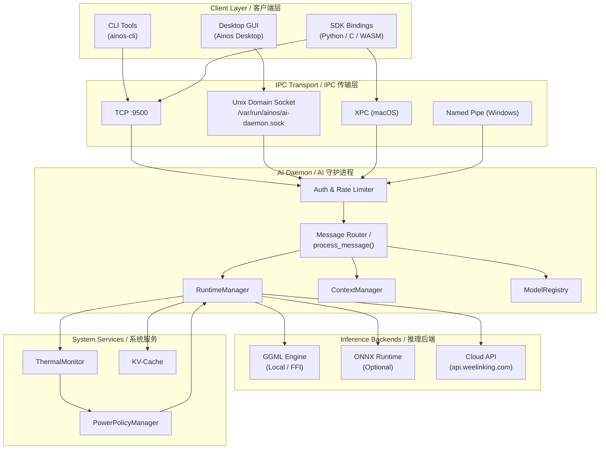
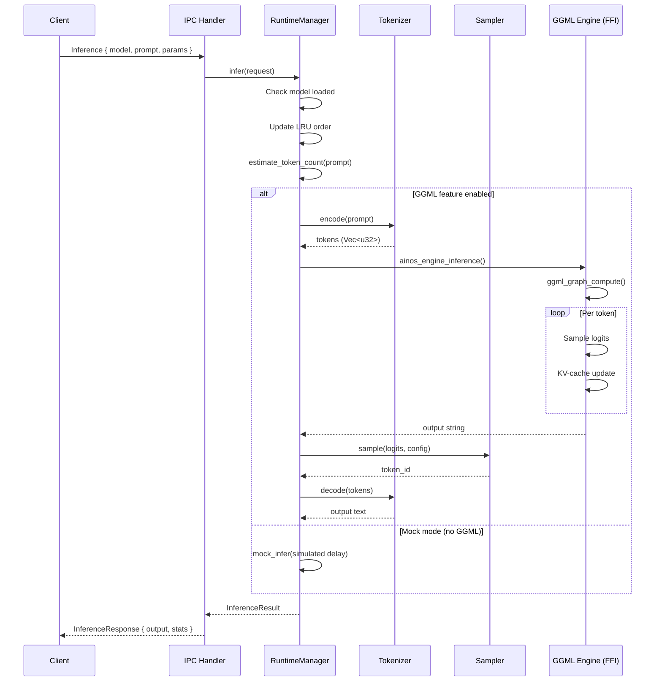
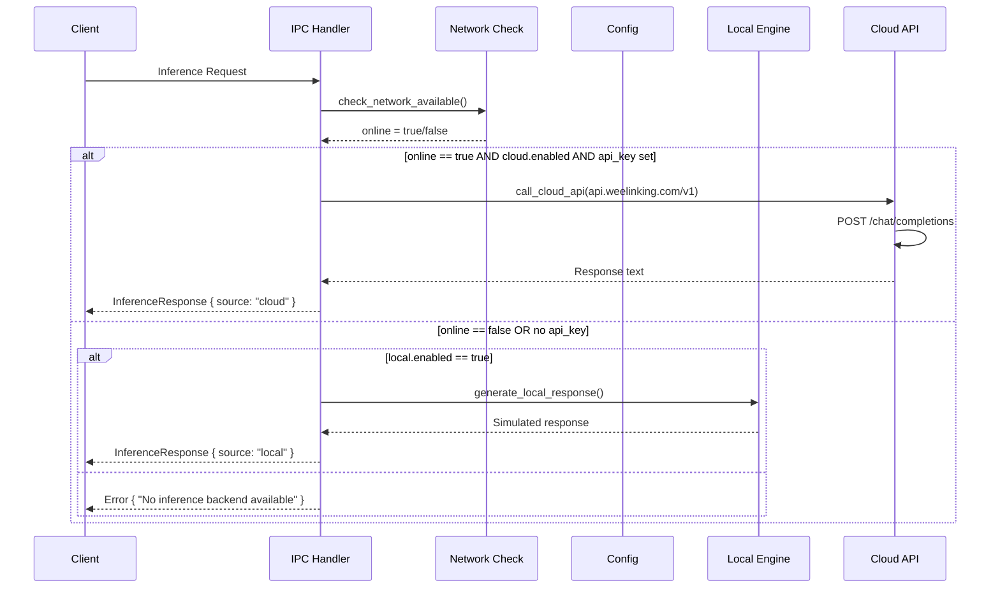
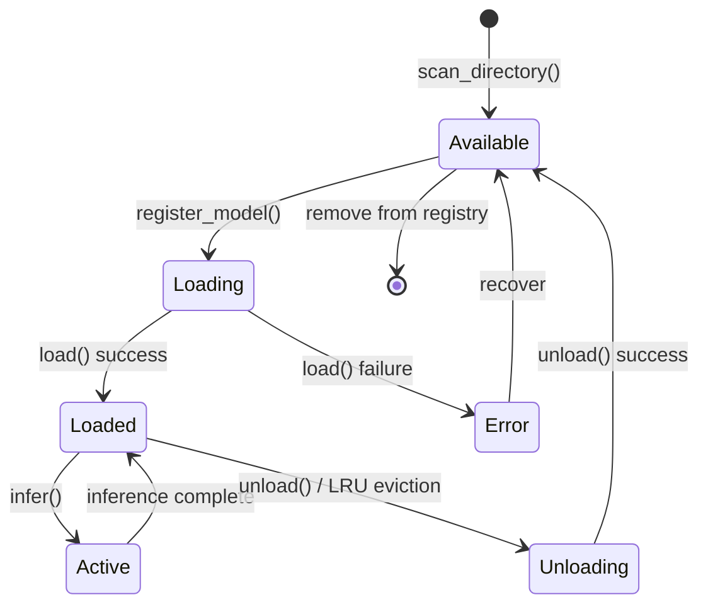
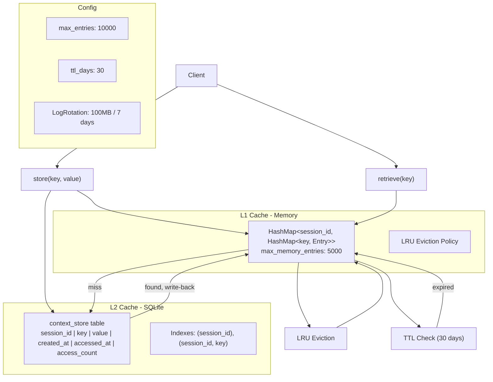
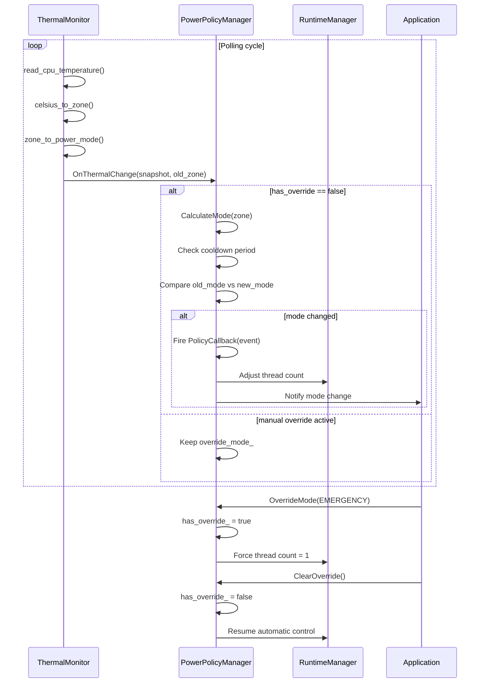
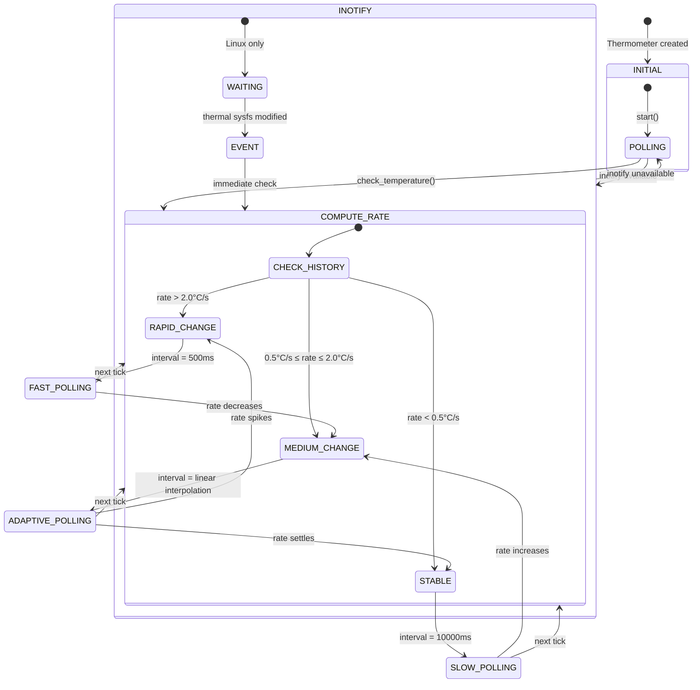

# AinosOS AI Runtime Architecture
# AinosOS AI 运行时架构

> **Document ID:** ARCH-RUNTIME-001
> **Version:** 1.0.0
> **Last Updated:** 2026-08-04
> **Status:** DRAFT

---

## Table of Contents / 目录

1. [Overview / 概述](#1-overview--概述)
2. [GGML Engine Integration / GGML 引擎集成](#2-ggml-engine-integration--ggml-引擎集成)
3. [ONNX Runtime Integration / ONNX 运行时集成](#3-onnx-runtime-integration--onnx-运行时集成)
4. [Model Management / 模型管理](#4-model-management--模型管理)
5. [Context Management / 上下文管理](#5-context-management--上下文管理)
6. [Power Policy / 电源策略](#6-power-policy--电源策略)
7. [Thermal Management / 温度管理](#7-thermal-management--温度管理)

---

## 1. Overview / 概述

AinosOS AI Runtime is the core inference engine of the Ainos operating system. It provides local
GGML-based inference (via GGUF model files), optional ONNX Runtime backend, cloud API fallback
via the Weelink Platform, session-level context management, and thermal-aware power policy
scheduling. The system is designed as a multi-threaded, async Rust daemon (`ai-daemon`) that
exposes a JSON-over-TCP/UDS IPC interface to client applications.

AinosOS AI 运行时是 Ainos 操作系统的核心推理引擎。它提供基于 GGML 的本地推理
（通过 GGUF 模型文件）、可选的 ONNX Runtime 后端、通过 Weelink 平台的云端 API 回退、
会话级上下文管理以及温度感知的电源策略调度。该系统设计为一个多线程、异步的 Rust
守护进程（`ai-daemon`），通过 JSON-over-TCP/UDS IPC 接口向客户端应用程序提供服务。

### 1.1 Architecture Overview Diagram / 架构概览图



### 1.2 Source File Map / 源文件映射

| Component / 组件 | Source File / 源文件 | Language |
|---|---|---|
| C++ Runtime API Headers | `D:/Ainos/ai-runtime/include/ainos/ai_runtime.h` | C++ |
| C++ Power Policy Headers | `D:/Ainos/ai-runtime/include/ainos/power_policy.h` | C++ |
| Rust Runtime Manager | `D:/Ainos/system-services/ai-daemon/src/runtime.rs` | Rust |
| Rust Model Registry | `D:/Ainos/system-services/ai-daemon/src/models.rs` | Rust |
| Rust Context Manager | `D:/Ainos/system-services/ai-daemon/src/context.rs` | Rust |
| Rust Thermal Monitor | `D:/Ainos/system-services/ai-daemon/src/thermal.rs` | Rust |
| Rust IPC Handler | `D:/Ainos/system-services/ai-daemon/src/ipc.rs` | Rust |
| Rust Daemon Config | `D:/Ainos/system-services/ai-daemon/src/config.rs` | Rust |
| Python Model Downloader | `D:/Ainos/scripts/download_model.py` | Python |
| Daemon Entry Point | `D:/Ainos/system-services/ai-daemon/src/main.rs` | Rust |

---

## 2. GGML Engine Integration / GGML 引擎集成

### 2.1 Overview / 概述

The GGML engine is the primary local inference backend for AinosOS. It uses the `ggml` library
via FFI (Foreign Function Interface) to load and execute GGUF-format quantized models.
The engine is feature-gated behind the `ggml` feature flag in `Cargo.toml`.

GGML 引擎是 AinosOS 主要的本地推理后端。它通过 FFI（外部函数接口）使用 `ggml` 库
来加载和执行 GGUF 格式的量化模型。该引擎通过 `Cargo.toml` 中的 `ggml` 特性标志进行条件编译。

### 2.2 Feature Flags / 特性标志

Defined in `D:/Ainos/system-services/ai-daemon/src/runtime.rs` (lines 5-9):

```rust
// Feature flags:
// - `ggml`: 启用真实 GGML FFI 推理
// - `onnx`: 启用 ONNX Runtime 集成
// - `cuda`: 启用 CUDA GPU 加速
// - `vulkan`: 启用 Vulkan GPU 加速
```

| Flag / 标志 | Purpose / 用途 | Status |
|---|---|---|
| `ggml` | Enables real GGML FFI inference | Default |
| `onnx` | Enables ONNX Runtime backend | Optional |
| `cuda` | Enables CUDA GPU acceleration | Experimental |
| `vulkan` | Enables Vulkan GPU acceleration | Planned |

### 2.3 Engine Types / 引擎类型

Defined in `D:/Ainos/system-services/ai-daemon/src/runtime.rs` (lines 62-68):

```rust
/// 推理引擎类型
#[derive(Debug, Clone, PartialEq, Eq, Hash)]
pub enum EngineType {
    /// 本地 GGML 推理
    GGML,
    /// ONNX Runtime (云端回退)
    ONNX,
}
```

### 2.4 Quantization Types / 量化类型

The runtime supports 7 quantization levels, defined in `D:/Ainos/system-services/ai-daemon/src/runtime.rs`
(lines 71-81):

```rust
/// 量化类型
#[derive(Debug, Clone, Copy, PartialEq, Eq)]
pub enum QuantizationType {
    Q4_0,
    Q4_1,
    Q5_0,
    Q5_1,
    Q8_0,
    F16,
    F32,
}
```

**Quantization Size Table / 量化大小对照表:**

| Quantization / 量化类型 | Size Multiplier / 大小倍数 | GGML Type Constant / GGML 类型常量 | Bits per Weight / 每权重比特 |
|---|---|---|---|
| `Q4_0` | 0.25x | `GGML_TYPE_Q4_0` (2) | 4.0 |
| `Q4_1` | 0.28x | `GGML_TYPE_Q4_1` (3) | 4.5 |
| `Q5_0` | 0.31x | `GGML_TYPE_Q5_0` (6) | 5.0 |
| `Q5_1` | 0.35x | `GGML_TYPE_Q5_1` (7) | 5.5 |
| `Q8_0` | 0.50x | `GGML_TYPE_Q8_0` (8) | 8.0 |
| `F16` | 0.50x | `GGML_TYPE_F16` (1) | 16.0 |
| `F32` | 1.00x | `GGML_TYPE_F32` (0) | 32.0 |

The `size_multiplier()` method (lines 98-108) returns the memory footprint relative to FP32:

```rust
pub fn size_multiplier(&self) -> f32 {
    match self {
        Self::Q4_0 => 0.25,
        Self::Q4_1 => 0.28,
        Self::Q5_0 => 0.31,
        Self::Q5_1 => 0.35,
        Self::Q8_0 => 0.50,
        Self::F16 => 0.50,
        Self::F32 => 1.0,
    }
}
```

### 2.5 Model File Extensions / 模型文件扩展名

The daemon supports four model file extensions, validated in the IPC handler
(`D:/Ainos/system-services/ai-daemon/src/ipc.rs`, line 833):

```rust
let supported_extensions = ["gguf", "ggml", "onnx", "bin"];
```

| Extension / 扩展名 | Format / 格式 | Backend / 后端 |
|---|---|---|
| `.gguf` | GGUF (GGML Universal Format) | GGML |
| `.ggml` | GGML Legacy Format | GGML |
| `.onnx` | ONNX Format | ONNX Runtime |
| `.bin` | Raw Binary Format | GGML / Custom |

### 2.6 Quantization Detection / 量化检测

The runtime automatically detects quantization type from the file path, via
`D:/Ainos/system-services/ai-daemon/src/runtime.rs` (lines 1139-1149):

```rust
pub(crate) fn detect_quantization(path: &str) -> Option<QuantizationType> {
    let lower = path.to_lowercase();
    if lower.contains("q4_0") || lower.contains("q4-0") { Some(QuantizationType::Q4_0) }
    else if lower.contains("q4_1") || lower.contains("q4-1") { Some(QuantizationType::Q4_1) }
    else if lower.contains("q5_0") || lower.contains("q5-0") { Some(QuantizationType::Q5_0) }
    else if lower.contains("q5_1") || lower.contains("q5-1") { Some(QuantizationType::Q5_1) }
    else if lower.contains("q8_0") || lower.contains("q8-0") { Some(QuantizationType::Q8_0) }
    else if lower.contains("f16") || lower.contains("fp16") { Some(QuantizationType::F16) }
    else if lower.contains("f32") || lower.contains("fp32") { Some(QuantizationType::F32) }
    else { None }
}
```

### 2.7 Architecture Detection / 架构检测

Model architecture is detected from the filename (`D:/Ainos/system-services/ai-daemon/src/runtime.rs`,
lines 1152-1163):

```rust
pub(crate) fn detect_architecture(path: &str) -> &'static str {
    let lower = path.to_lowercase();
    if lower.contains("llama") { "llama" }
    else if lower.contains("phi") { "phi3" }
    else if lower.contains("mistral") { "mistral" }
    else if lower.contains("falcon") { "falcon" }
    else if lower.contains("gemma") { "gemma" }
    else if lower.contains("qwen") { "qwen2" }
    else if lower.contains("chatglm") || lower.contains("glm") { "chatglm" }
    else if lower.contains("starcoder") || lower.contains("codellama") { "starcoder" }
    else { "auto" }
}
```

### 2.8 GGML FFI Bindings / GGML FFI 绑定

The FFI bindings are defined in `D:/Ainos/system-services/ai-daemon/src/runtime.rs` (lines 302-412),
gated behind `#[cfg(feature = "ggml")]`:

**GGML Core Library FFI (lines 310-347):**

```rust
#[link(name = "ggml")]
extern "C" {
    pub fn ggml_init(mem_size: usize) -> *mut c_void;
    pub fn ggml_free(ctx: *mut c_void);
    pub fn ggml_time_us() -> i64;
    pub fn ggml_quantize_q4_0(
        src: *const c_void, dst: *mut c_void, n: c_int, k: c_int, hist: *mut i64,
    ) -> usize;
    pub fn ggml_quantize_q4_1(
        src: *const c_void, dst: *mut c_void, n: c_int, k: c_int, hist: *mut i64,
    ) -> usize;
    pub fn ggml_quantize_q5_0(
        src: *const c_void, dst: *mut c_void, n: c_int, k: c_int, hist: *mut i64,
    ) -> usize;
    pub fn ggml_quantize_q5_1(
        src: *const c_void, dst: *mut c_void, n: c_int, k: c_int, hist: *mut i64,
    ) -> usize;
    pub fn ggml_quantize_q8_0(
        src: *const c_void, dst: *mut c_void, n: c_int, k: c_int, hist: *mut i64,
    ) -> usize;
    pub fn ggml_new_tensor_1d(ctx: *mut c_void, dtype: c_int, ne0: c_int) -> *mut c_void;
    pub fn ggml_new_tensor_2d(ctx: *mut c_void, dtype: c_int, ne0: c_int, ne1: c_int) -> *mut c_void;
    pub fn ggml_set_param(ctx: *mut c_void, tensor: *mut c_void);
    pub fn ggml_set_i32(tensor: *mut c_void, value: c_int);
    pub fn ggml_set_f32(tensor: *mut c_void, value: c_float);
    pub fn ggml_get_i32_1d(tensor: *const c_void, i: c_int) -> c_int;
    pub fn ggml_get_f32_1d(tensor: *const c_void, i: c_int) -> c_float;
    pub fn ggml_build_forward_expand(ctx: *mut c_void, gf: *mut c_void, tensor: *mut c_void);
    pub fn ggml_graph_compute(ctx: *mut c_void, gf: *mut c_void, n_threads: c_int);
    pub fn ggml_graph_export(gf: *const c_void, fname: *const c_char);
    pub fn ggml_graph_print(gf: *const c_void);
    pub fn ggml_opt(ctx: *mut c_void, opt: *mut c_void, tensor: *mut c_void, niter: c_int);
    pub fn gguf_init_from_file(fname: *const c_char, use_mmap: bool) -> *mut c_void;
    pub fn gguf_free(ctx: *mut c_void);
    pub fn gguf_get_n_tensors(ctx: *const c_void) -> c_int;
    pub fn gguf_get_tensor_name(ctx: *const c_void, i: c_int) -> *const c_char;
    pub fn gguf_get_tensor(ctx: *const c_void, name: *const c_char) -> *mut c_void;
}
```

**Ainos Runtime C++ Wrapper FFI (lines 351-397):**

```rust
#[link(name = "ainos_ai_runtime")]
extern "C" {
    pub fn ainos_engine_create() -> *mut c_void;
    pub fn ainos_engine_destroy(engine: *mut c_void);
    pub fn ainos_engine_load_model(
        engine: *mut c_void, model_path: *const c_char, model_id: *const c_char,
    ) -> c_int;
    pub fn ainos_engine_unload_model(engine: *mut c_void, model_id: *const c_char) -> c_int;
    pub fn ainos_engine_inference(
        engine: *mut c_void,
        model_id: *const c_char,
        prompt: *const c_char,
        output: *mut *mut c_char,
        max_tokens: c_int,
        temperature: c_float,
        top_p: c_float,
        top_k: c_int,
        num_threads: c_int,
    ) -> c_int;
    pub fn ainos_engine_free_string(s: *mut c_char);
    pub fn ainos_engine_get_model_info(
        engine: *mut c_void,
        model_id: *const c_char,
        out_model_path: *mut *mut c_char,
        out_loaded_time: *mut i64,
        out_memory_usage: *mut u64,
        out_device: *mut c_int,
    ) -> c_int;
    pub fn ainos_onnx_service_create() -> *mut c_void;
    pub fn ainos_onnx_service_destroy(service: *mut c_void);
    pub fn ainos_onnx_service_load_model(
        service: *mut c_void, model_path: *const c_char, model_id: *const c_char,
    ) -> c_int;
    pub fn ainos_onnx_service_unload_model(
        service: *mut c_void, model_id: *const c_char,
    ) -> c_int;
    pub fn ainos_model_manager_create() -> *mut c_void;
    pub fn ainos_model_manager_destroy(mgr: *mut c_void);
    pub fn ainos_model_manager_register(
        mgr: *mut c_void, model_id: *const c_char,
        model_path: *const c_char, framework: *const c_char,
    ) -> c_int;
    pub fn ainos_model_manager_unregister(mgr: *mut c_void, model_id: *const c_char) -> c_int;
    pub fn ainos_model_manager_load(mgr: *mut c_void, model_id: *const c_char) -> c_int;
    pub fn ainos_model_manager_unload(mgr: *mut c_void, model_id: *const c_char) -> c_int;
    pub fn ainos_model_manager_optimize_memory(mgr: *mut c_void) -> c_int;
}
```

### 2.9 C++ Status to Rust Error Conversion

The FFI bridge converts C++ status codes to Rust `RuntimeError` values
(`D:/Ainos/system-services/ai-daemon/src/runtime.rs`, lines 400-412):

```rust
pub fn status_to_result(status: c_int) -> Result<(), RuntimeError> {
    match status {
        0 => Ok(()),
        -1 => Err(RuntimeError::InvalidParameter("FFI call failed".into())),
        -2 => Err(RuntimeError::ModelNotFound("FFI: model not found".into())),
        -3 => Err(RuntimeError::InferenceFailed("FFI: inference failed".into())),
        -4 => Err(RuntimeError::OutOfMemory("FFI: out of memory".into())),
        -5 => Err(RuntimeError::EngineNotInitialized("FFI: device not available".into())),
        -6 => Err(RuntimeError::ContextOverflow("FFI: context overflow".into())),
        -7 => Err(RuntimeError::InferenceFailed("FFI: serialization failed".into())),
        _ => Err(RuntimeError::InferenceFailed(format!("FFI: unknown error {}", status))),
    }
}
```

### 2.10 RuntimeError Types / 错误类型

Defined in `D:/Ainos/system-services/ai-daemon/src/runtime.rs` (lines 24-49):

```rust
#[derive(Error, Debug, Clone)]
pub enum RuntimeError {
    #[error("Model not found: {0}")]
    ModelNotFound(String),

    #[error("Model not loaded: {0}")]
    ModelNotLoaded(String),

    #[error("Engine not initialized: {0}")]
    EngineNotInitialized(String),

    #[error("Inference failed: {0}")]
    InferenceFailed(String),

    #[error("Invalid parameter: {0}")]
    InvalidParameter(String),

    #[error("Out of memory: {0}")]
    OutOfMemory(String),

    #[error("Context overflow: {0}")]
    ContextOverflow(String),

    #[error("Unsupported operation: {0}")]
    Unsupported(String),
}
```

| Error Type / 错误类型 | Description / 描述 | FFI Mapping |
|---|---|---|
| `ModelNotFound` | Model file not found on disk | Status -2 |
| `ModelNotLoaded` | Model not loaded in memory | N/A |
| `EngineNotInitialized` | Engine not initialized or device unavailable | Status -5 |
| `InferenceFailed` | Inference execution failed | Status -3, -7 |
| `InvalidParameter` | Invalid input parameters | Status -1 |
| `OutOfMemory` | Out of memory during inference | Status -4 |
| `ContextOverflow` | Context window exceeded | Status -6 |
| `Unsupported` | Unsupported operation | N/A |

### 2.11 Inference Request / 推理请求

Defined in `D:/Ainos/system-services/ai-daemon/src/runtime.rs` (lines 126-157):

```rust
#[derive(Debug, Clone)]
pub struct InferenceRequest {
    pub model: String,
    pub prompt: String,
    pub temperature: f32,
    pub top_p: f32,
    pub top_k: u32,
    pub max_tokens: u32,
    pub session_id: Option<String>,
    pub num_threads: Option<u32>,
    pub repeat_penalty: f32,
    pub frequency_penalty: f32,
    pub presence_penalty: f32,
}
```

**Default Sampling Parameters / 默认采样参数 (lines 141-157):**

| Parameter / 参数 | Default / 默认值 | Range / 范围 |
|---|---|---|
| `temperature` | 0.7 | 0.0 - 2.0 |
| `top_p` | 0.9 | 0.0 - 1.0 |
| `top_k` | 40 | 1 - vocab_size |
| `max_tokens` | 512 | 1 - context_length |
| `repeat_penalty` | 1.1 | 1.0 - 2.0 |
| `frequency_penalty` | 0.0 | 0.0 - 2.0 |
| `presence_penalty` | 0.0 | 0.0 - 2.0 |

### 2.12 Inference Result / 推理结果

Defined in `D:/Ainos/system-services/ai-daemon/src/runtime.rs` (lines 180-188):

```rust
#[derive(Debug, Clone)]
pub struct InferenceResult {
    pub output: String,
    pub tokens_generated: u32,
    pub prompt_tokens: u32,
    pub inference_ms: u64,
    pub tokens_per_second: f64,
    pub engine: EngineType,
}
```

### 2.13 Streaming Inference / 流式推理

The runtime supports streaming inference via the `infer_streaming` method
(`D:/Ainos/system-services/ai-daemon/src/runtime.rs`, lines 861-884):

```rust
pub async fn infer_streaming<F: FnMut(&str)>(
    &mut self,
    request: InferenceRequest,
    mut callback: F,
) -> Result<InferenceResult, RuntimeError> {
    let start = Instant::now();

    if !self.models.contains_key(&request.model) {
        return Err(RuntimeError::ModelNotLoaded(format!(
            "Model '{}' not loaded.", request.model
        )));
    }

    self.update_lru(&request.model);
    self.total_inferences.fetch_add(1, Ordering::Relaxed);

    let result = self.infer_streaming_inner(&request, &mut callback).await?;

    let elapsed = start.elapsed().as_millis() as u64;
    self.total_inference_ms.fetch_add(elapsed, Ordering::Relaxed);
    self.total_tokens_generated.fetch_add(result.tokens_generated as u64, Ordering::Relaxed);

    Ok(result)
}
```

### 2.14 Sampling Algorithm / 采样算法

The full sampling pipeline (temperature scaling + top-k + top-p + stochastic sampling)
is implemented in `D:/Ainos/system-services/ai-daemon/src/runtime.rs` (lines 488-562):

```rust
#[cfg(feature = "ggml")]
pub fn sample(&mut self, logits: &[f32], config: &SamplingConfig) -> u32 {
    use std::cmp::Ordering;

    let mut logits = logits.to_vec();

    // 1. 温度缩放
    if config.temperature > 0.0 {
        let inv_temp = 1.0 / config.temperature;
        for logit in logits.iter_mut() {
            *logit *= inv_temp;
        }
    }

    // 2. Top-K 过滤
    if config.top_k > 0 && (config.top_k as usize) < logits.len() {
        let k = config.top_k as usize;
        let mut indices: Vec<usize> = (0..logits.len()).collect();
        indices.partial_sort_by(|&a, &b| logits[b].partial_cmp(&logits[a]).unwrap_or(Ordering::Equal));
        let threshold = logits[indices[k - 1]];
        for logit in logits.iter_mut() {
            if *logit < threshold {
                *logit = f32::NEG_INFINITY;
            }
        }
    }

    // 3. Top-P (nucleus) 过滤
    if config.top_p > 0.0 && config.top_p < 1.0 {
        let max_logit = logits.iter().cloned().fold(f32::NEG_INFINITY, f32::max);
        let exp_sum: f32 = logits.iter().map(|l| (l - max_logit).exp()).sum();
        let mut probs: Vec<(usize, f32)> = logits.iter().enumerate().map(|(i, l)| {
            (i, (l - max_logit).exp() / exp_sum)
        }).collect();
        probs.sort_by(|a, b| b.1.partial_cmp(&a.1).unwrap_or(Ordering::Equal));

        let mut cumsum = 0.0;
        let mut threshold = 0.0;
        for (i, &(_, prob)) in probs.iter().enumerate() {
            cumsum += prob;
            if cumsum > config.top_p {
                threshold = prob;
                break;
            }
        }
        if threshold > 0.0 {
            for (i, logit) in logits.iter_mut().enumerate() {
                let prob = (*logit - max_logit).exp() / exp_sum;
                if prob < threshold {
                    *logit = f32::NEG_INFINITY;
                }
            }
        }
    }

    // 4. 从剩余 logits 中采样
    let max_logit = logits.iter().cloned().fold(f32::NEG_INFINITY, f32::max);
    let exp_sum: f32 = logits.iter().map(|l| (l - max_logit).exp()).sum();

    if exp_sum <= 0.0 || exp_sum.is_nan() {
        return 0;
    }

    let r: f32 = self.rng.f32();
    let mut cumulative = 0.0;
    for (i, logit) in logits.iter().enumerate() {
        cumulative += (logit - max_logit).exp() / exp_sum;
        if r <= cumulative {
            return i as u32;
        }
    }

    (logits.len() - 1) as u32
}
```

### 2.15 KV-Cache Management / KV 缓存管理

KV-cache state is tracked in `D:/Ainos/system-services/ai-daemon/src/runtime.rs`
(lines 249-272):

```rust
#[derive(Debug, Clone)]
pub struct KVCacheState {
    pub max_seq_len: usize,
    pub n_layers: usize,
    pub n_heads: usize,
    pub n_embd: usize,
    pub current_seq_len: usize,
    pub memory_usage: u64,
}

impl KVCacheState {
    pub fn new(n_layers: usize, n_heads: usize, n_embd: usize, max_seq_len: usize) -> Self {
        let cache_size = n_layers * n_heads * n_embd * max_seq_len * 2; // K + V
        Self {
            max_seq_len,
            n_layers,
            n_heads,
            n_embd,
            current_seq_len: 0,
            memory_usage: (cache_size * 2) as u64, // FP16: 2 bytes per element
        }
    }
}
```

KV-cache memory is allocated per model handle. The formula is:

```
memory_usage = n_layers * n_heads * n_embd * max_seq_len * 2 * 2 bytes
             = n_layers * n_heads * n_embd * max_seq_len * 4 bytes
```

### 2.16 Context Window Management / 上下文窗口管理

The runtime manages context windows at the `RuntimeManager` level
(`D:/Ainos/system-services/ai-daemon/src/runtime.rs`, lines 1108-1118):

```rust
/// 设置最大上下文长度
pub fn set_max_context_length(&mut self, length: u32) {
    self.max_context_length = length;
    info!("[RuntimeManager] Max context length set to {}", length);
}

/// 设置最大加载模型数
pub fn set_max_loaded_models(&mut self, count: u32) {
    self.max_loaded_models = count;
    info!("[RuntimeManager] Max loaded models set to {}", count);
}
```

Default context length: **4096 tokens**
Default max loaded models: **8**

### 2.17 Power Policy-Aware Inference / 电源感知推理

The runtime integrates with the thermal monitor to adjust thread counts based on
temperature. The `RuntimeManager` queries `ThermalMonitor::get_recommended_threads()`
during inference to determine the optimal thread count dynamically
(`D:/Ainos/system-services/ai-daemon/src/runtime.rs`, lines 953-955):

```rust
let num_threads = request.num_threads.unwrap_or_else(|| {
    std::thread::available_parallelism().map(|n| n.get() as u32).unwrap_or(4)
}) as i32;
```

### 2.18 GGML Inference Pipeline Flow / 推理管线流程



### 2.19 Engine Initialization / 引擎初始化

The GGML engine is initialized at `RuntimeManager::new()` time
(`D:/Ainos/system-services/ai-daemon/src/runtime.rs`, lines 618-644):

```rust
impl RuntimeManager {
    pub fn new() -> Self {
        #[cfg(feature = "ggml")]
        let ggml_engine = Self::init_ggml_engine();

        info!("[RuntimeManager] Initialized (ggml={}, onnx={})",
            cfg!(feature = "ggml"), cfg!(feature = "onnx"));

        Self {
            models: HashMap::new(),
            active_engine: EngineType::GGML,
            max_loaded_models: 8,
            max_context_length: 4096,
            load_order: Vec::new(),
            #[cfg(feature = "ggml")]
            ggml_engine,
            #[cfg(feature = "onnx")]
            onnx_service: None,
            total_inferences: AtomicU64::new(0),
            total_tokens_generated: AtomicU64::new(0),
            total_inference_ms: AtomicU64::new(0),
            total_prompt_tokens: AtomicU64::new(0),
            total_model_loads: AtomicU64::new(0),
            total_model_unloads: AtomicU64::new(0),
            total_errors: AtomicU64::new(0),
        }
    }
}
```

### 2.20 Model Warmup / 模型预热

After loading, models are warmed up with a short inference request
(`D:/Ainos/system-services/ai-daemon/src/runtime.rs`, lines 1121-1136):

```rust
#[cfg(feature = "ggml")]
fn warmup_model(&mut self, model_id: &str) -> Result<(), RuntimeError> {
    debug!("[RuntimeManager] Warming up model: {}", model_id);
    let warmup_req = InferenceRequest {
        model: model_id.to_string(),
        prompt: "Hi".to_string(),
        max_tokens: 1,
        temperature: 0.0,
        ..Default::default()
    };
    let _ = warmup_req;
    Ok(())
}
```

---

## 3. ONNX Runtime Integration / ONNX 运行时集成

### 3.1 Overview / 概述

The ONNX Runtime backend provides an alternative inference path for models in the ONNX format.
It is feature-gated behind `#[cfg(feature = "onnx")]` and serves as both a local inference
backend and a cloud fallback when the primary GGML engine produces low-confidence results.

ONNX 运行时后端为 ONNX 格式的模型提供了替代推理路径。它通过 `#[cfg(feature = "onnx")]`
进行条件编译，既作为本地推理后端，也作为主要 GGML 引擎产生低置信度结果时的云端回退方案。

### 3.2 C++ ONNX Service Interface / C++ ONNX 服务接口

Defined in `D:/Ainos/ai-runtime/include/ainos/ai_runtime.h` (lines 110-120):

```cpp
class IONNXService {
public:
    virtual ~IONNXService() = default;

    virtual Status LoadModel(const std::string& model_path, const std::string& model_id) = 0;
    virtual Status UnloadModel(const std::string& model_id) = 0;
    virtual Status Inference(const std::string& model_id,
                           const std::vector<Tensor>& inputs,
                           std::vector<Tensor>& outputs) = 0;
    virtual Status GetModelInfo(const std::string& model_id, ModelMetadata& metadata) = 0;
};
```

### 3.3 Rust FFI Bindings / Rust FFI 绑定

From `D:/Ainos/system-services/ai-daemon/src/runtime.rs` (lines 379-386):

```rust
#[link(name = "ainos_ai_runtime")]
extern "C" {
    pub fn ainos_onnx_service_create() -> *mut c_void;
    pub fn ainos_onnx_service_destroy(service: *mut c_void);
    pub fn ainos_onnx_service_load_model(
        service: *mut c_void, model_path: *const c_char, model_id: *const c_char,
    ) -> c_int;
    pub fn ainos_onnx_service_unload_model(
        service: *mut c_void, model_id: *const c_char,
    ) -> c_int;
}
```

### 3.4 Cloud API Integration / 云端 API 集成

When the local inference engine is unavailable or confidence is low, the daemon falls back
to the cloud API. The cloud integration is configured in `D:/Ainos/system-services/ai-daemon/src/config.rs`
(lines 123-129):

```rust
enable_cloud: true,
cloud_api_url: "https://api.weelinking.com/v1".to_string(),
cloud_api_key: "".to_string(),
cloud_model: "gpt-5.6-sol".to_string(),
network_check_interval: 30,
cloud_fallback_confidence: 0.6,
```

**Cloud Configuration Fields / 云端配置字段:**

| Field / 字段 | Default / 默认值 | Description / 描述 |
|---|---|---|
| `enable_cloud` | `true` | Enable cloud API fallback |
| `cloud_api_url` | `https://api.weelinking.com/v1` | Weelink Platform API endpoint |
| `cloud_api_key` | `""` | Bearer token for API authentication |
| `cloud_model` | `gpt-5.6-sol` | Cloud model identifier |
| `network_check_interval` | `30` (seconds) | Interval between network availability checks |
| `cloud_fallback_confidence` | `0.6` | Confidence threshold for local->cloud fallback |

### 3.5 HTTP Client with Connection Pooling / 带连接池的 HTTP 客户端

The global HTTP client is defined in `D:/Ainos/system-services/ai-daemon/src/ipc.rs` (lines 28-37):

```rust
fn http_client() -> &'static reqwest::Client {
    static CLIENT: OnceLock<reqwest::Client> = OnceLock::new();
    CLIENT.get_or_init(|| {
        reqwest::Client::builder()
            .timeout(std::time::Duration::from_secs(30))
            .user_agent("Ainos-AI-Daemon/1.0")
            .build()
            .expect("Failed to build HTTP client")
    })
}
```

**Client Configuration / 客户端配置:**

| Property / 属性 | Value / 值 |
|---|---|
| Timeout / 超时 | 30 seconds |
| User-Agent | `Ainos-AI-Daemon/1.0` |
| Connection pooling | Automatic (reqwest default) |
| TLS | Native-tls or rustls |

### 3.6 Cloud API Call / 云端 API 调用

The `call_cloud_api` function sends OpenAI-compatible chat completion requests to the Weelink
Platform (`D:/Ainos/system-services/ai-daemon/src/ipc.rs`, lines 983-1036):

```rust
async fn call_cloud_api(
    api_url: &str,
    api_key: &str,
    model: &str,
    prompt: &str,
    temperature: f32,
    max_tokens: u32,
) -> Result<String, String> {
    let base_url = api_url.trim_end_matches('/');
    let url = format!("{}/chat/completions", base_url);

    let body = serde_json::json!({
        "model": model,
        "messages": [
            {
                "role": "system",
                "content": "你是一个有用的AI助手，名字叫Ainos。请用中文回答用户的问题。"
            },
            {
                "role": "user",
                "content": prompt
            }
        ],
        "temperature": temperature,
        "max_tokens": max_tokens,
    });

    let mut req = http_client()
        .post(&url)
        .json(&body)
        .header("Content-Type", "application/json");

    if !api_key.is_empty() {
        req = req.header("Authorization", format!("Bearer {}", api_key));
    }

    let resp = req.send().await.map_err(|e| format!("Request failed: {}", e))?;
    let status = resp.status();

    if !status.is_success() {
        let body_text = resp.text().await.unwrap_or_default();
        return Err(format!("API returned {}: {}", status, body_text));
    }

    let data: serde_json::Value = resp.json().await.map_err(|e| format!("Parse failed: {}", e))?;

    let content = data["choices"][0]["message"]["content"]
        .as_str()
        .ok_or_else(|| "No content in response".to_string())?
        .to_string();

    Ok(content)
}
```

### 3.7 Network Detection / 网络检测

Network availability is checked via TCP connectivity to Google DNS (8.8.8.8:53)
(`D:/Ainos/system-services/ai-daemon/src/ipc.rs`, lines 1086-1094):

```rust
pub(crate) async fn check_network_available() -> bool {
    match tokio::time::timeout(
        std::time::Duration::from_secs(3),
        tokio::net::TcpStream::connect("8.8.8.8:53")
    ).await {
        Ok(Ok(_)) => true,
        _ => false,
    }
}
```

### 3.8 Local->Cloud Fallback Decision / 本地到云端回退决策

The inference handler in `D:/Ainos/system-services/ai-daemon/src/ipc.rs` (lines 778-816)
decides between local and cloud inference based on:

1. Network availability (`check_network_available()`)
2. Cloud API key presence (`!s.config.cloud_api_key.is_empty()`)
3. Cloud feature enabled (`s.config.enable_cloud`)
4. Local inference enabled (`s.config.enable_local`)

```rust
async fn handle_inference(
    state: Arc<RwLock<AppState>>,
    model: String, prompt: String,
    temperature: Option<f32>, max_tokens: Option<u32>,
    _session_id: Option<String>, _client: &ClientState,
) -> IpcMessage {
    let is_online = check_network_available().await;
    let s = state.read().await;
    s.stats.total_requests.fetch_add(1, Ordering::Relaxed);

    if is_online && s.config.enable_cloud && !s.config.cloud_api_key.is_empty() {
        // --> CLOUD INFERENCE PATH
        let api_url = s.config.cloud_api_url.clone();
        let api_key = s.config.cloud_api_key.clone();
        let cloud_model = if model == "default" { s.config.cloud_model.clone() } else { model.clone() };
        let temp = temperature.unwrap_or(0.7);
        let max_tok = max_tokens.unwrap_or(1024);
        s.stats.cloud_inferences.fetch_add(1, Ordering::Relaxed);
        drop(s);

        match call_cloud_api(&api_url, &api_key, &cloud_model, &prompt, temp, max_tok).await {
            Ok(response_text) => { /* cloud response */ }
            Err(e) => { /* return error */ }
        }
    } else if s.config.enable_local {
        // --> LOCAL INFERENCE PATH
        s.stats.local_inferences.fetch_add(1, Ordering::Relaxed);
        let reason = if is_online && s.config.enable_cloud {
            "未配置 API Key，使用本地推理"
        } else {
            "离线模式，使用本地推理"
        };
        let output = generate_local_response(&prompt, reason);
        // ...
    } else {
        // --> NO BACKEND AVAILABLE
        IpcMessage::Error { code: -1, message: "No inference backend available".to_string() }
    }
}
```

### 3.9 Local->Cloud Fallback Sequence Diagram / 回退序列图



### 3.10 Local Response Generation / 本地响应生成

When no cloud API key is available, the daemon generates contextually relevant canned
responses (`D:/Ainos/system-services/ai-daemon/src/ipc.rs`, lines 1053-1075):

```rust
pub(crate) fn generate_local_response(prompt: &str, reason: &str) -> String {
    let prompt_lower = prompt.to_lowercase();
    let response = if prompt_lower.contains("ainos") && reason.contains("API Key") {
        format!(
            "[Ainos 离线推理] Ainos OS 是一个AI原生的操作系统，\
             它将AI能力深度集成到系统内核和服务层中，\
             支持离线推理、云端回退、上下文管理和智能电源策略调度。\
             当前系统运行在本地模式（{}）。", reason
        )
    } else if prompt_lower.contains("hello") || prompt_lower.contains("hi") || prompt_lower.contains("你好") {
        format!(
            "[Ainos 离线推理] 你好！我是 Ainos AI 助手。\
             当前系统运行在本地模式（{}）。\
             我正在离线运行，可以帮你处理文本推理、上下文记忆和系统管理任务。", reason
        )
    } else {
        format!(
            "[Ainos 离线推理] 已收到你的问题。当前系统运行在本地模式（{}）。\
             模型推理引擎就绪，上下文管理正常运行。", reason
        )
    };
    response
}
```

### 3.11 Inference Statistics / 推理统计

The daemon tracks per-source inference statistics (`D:/Ainos/system-services/ai-daemon/src/ipc.rs`):

```rust
// In the IPC handler:
s.stats.cloud_inferences.fetch_add(1, Ordering::Relaxed);
s.stats.local_inferences.fetch_add(1, Ordering::Relaxed);
s.stats.errors.fetch_add(1, Ordering::Relaxed);
s.stats.total_requests.fetch_add(1, Ordering::Relaxed);
```

---

## 4. Model Management / 模型管理

### 4.1 Overview / 概述

The Model Registry (`ModelRegistry`) manages the lifecycle of AI models within the daemon.
It tracks both available models (scanned from disk) and loaded models (in memory).
The registry is defined in `D:/Ainos/system-services/ai-daemon/src/models.rs`.

模型注册表（`ModelRegistry`）管理守护进程中 AI 模型的生命周期。它跟踪可用模型
（从磁盘扫描）和已加载模型（在内存中）。注册表定义在 `D:/Ainos/system-services/ai-daemon/src/models.rs`。

### 4.2 ModelInfo Structure / 模型信息结构

Defined in `D:/Ainos/system-services/ai-daemon/src/ipc.rs` (lines 200-213):

```rust
#[derive(Debug, Clone, serde::Serialize, serde::Deserialize)]
pub struct ModelInfo {
    /// Unique model identifier (e.g. `"phi_3_mini_4k_instruct_q4_gguf"`).
    pub id: String,
    /// Human-readable model name (e.g. `"phi-3-mini-4k-instruct-q4.gguf"`).
    pub name: String,
    /// Absolute file path on disk.
    pub path: String,
    /// Model file size in megabytes.
    pub size_mb: u64,
    /// Whether the model is currently loaded in memory.
    pub loaded: bool,
    /// Model architecture string (e.g. `"auto"`, `"phi3"`, `"llama"`).
    pub architecture: String,
}
```

### 4.3 ModelRegistry Structure / 注册表结构

From `D:/Ainos/system-services/ai-daemon/src/models.rs` (lines 10-17):

```rust
#[derive(Debug)]
pub struct ModelRegistry {
    /// 所有可用模型 (path -> info)
    available: HashMap<String, ModelInfo>,
    /// 已加载模型 (id -> info)
    loaded: HashMap<String, ModelInfo>,
    /// 模型缓存最近使用
    lru_order: Vec<String>,
}
```

### 4.4 Model Directory Scanning / 模型目录扫描

Models are discovered by scanning a directory for supported file extensions
(`D:/Ainos/system-services/ai-daemon/src/models.rs`, lines 28-57):

```rust
pub fn scan_directory(&mut self, path: &str) -> std::io::Result<()> {
    let dir = std::fs::read_dir(path)?;
    for entry in dir.flatten() {
        let path = entry.path();
        if let Some(ext) = path.extension() {
            let ext = ext.to_string_lossy().to_lowercase();
            if matches!(ext.as_str(), "gguf" | "ggml" | "onnx" | "bin") {
                let file_name = path.file_name()
                    .map(|n| n.to_string_lossy().to_string())
                    .unwrap_or_default();
                let metadata = std::fs::metadata(&path)?;
                let size_mb = metadata.len() / (1024 * 1024);
                let model_id = file_name.replace('.', "_");

                let info = ModelInfo {
                    id: model_id.clone(),
                    name: file_name,
                    path: path.to_string_lossy().to_string(),
                    size_mb,
                    loaded: false,
                    architecture: "auto".to_string(),
                };
                self.available.insert(model_id, info);
            }
        }
    }
    info!("Scanned models directory: {} models found", self.available.len());
    Ok(())
}
```

### 4.5 Model Load / Unload Lifecycle / 模型加载/卸载生命周期



**Load method** (`D:/Ainos/system-services/ai-daemon/src/models.rs`, lines 59-74):

```rust
pub fn load(&mut self, model_id: &str) -> Result<(), String> {
    if let Some(info) = self.available.get(model_id) {
        if self.loaded.contains_key(model_id) {
            return Ok(()); // 已加载
        }
        let mut loaded_info = info.clone();
        loaded_info.loaded = true;
        self.loaded.insert(model_id.to_string(), loaded_info);
        self.lru_order.push(model_id.to_string());
        info!("Model loaded: {}", model_id);
        Ok(())
    } else {
        Err(format!("Model not found: {}", model_id))
    }
}
```

**Unload method** (`D:/Ainos/system-services/ai-daemon/src/models.rs`, lines 76-85):

```rust
pub fn unload(&mut self, model_id: &str) -> Result<(), String> {
    if self.loaded.remove(model_id).is_some() {
        self.lru_order.retain(|id| id != model_id);
        info!("Model unloaded: {}", model_id);
        Ok(())
    } else {
        Err(format!("Model not loaded: {}", model_id))
    }
}
```

### 4.6 Model Registration / 模型注册

The registry supports two registration methods:

**Full registration** (`D:/Ainos/system-services/ai-daemon/src/models.rs`, lines 111-132):

```rust
pub fn register_model(
    &mut self,
    model_id: String,
    name: String,
    path: String,
    size_mb: u64,
    architecture: &str,
) -> Result<(), String> {
    if self.available.contains_key(&model_id) {
        return Ok(());
    }
    let info = ModelInfo {
        id: model_id.clone(),
        name,
        path,
        size_mb,
        loaded: false,
        architecture: architecture.to_string(),
    };
    self.available.insert(model_id, info);
    Ok(())
}
```

**Simple registration** (legacy, `D:/Ainos/system-services/ai-daemon/src/models.rs`, lines 135-156):

```rust
pub fn register_model_simple(&mut self, model_id: &str, model_path: &str, framework: &str) -> Result<(), String> {
    if self.available.contains_key(model_id) {
        return Ok(());
    }
    let path_obj = std::path::Path::new(model_path);
    let file_name = path_obj.file_name()
        .map(|n| n.to_string_lossy().to_string())
        .unwrap_or_else(|| model_id.to_string());
    let metadata = std::fs::metadata(model_path).map_err(|e| format!("{}", e))?;
    let size_mb = metadata.len() / (1024 * 1024);

    let info = ModelInfo {
        id: model_id.to_string(),
        name: file_name,
        path: model_path.to_string(),
        size_mb,
        loaded: false,
        architecture: framework.to_string(),
    };
    self.available.insert(model_id.to_string(), info);
    Ok(())
}
```

### 4.7 Model Listing / 模型列表

The `list()` method returns all available models with their load status
(`D:/Ainos/system-services/ai-daemon/src/models.rs`, lines 92-103):

```rust
pub fn list(&self) -> Vec<ModelInfo> {
    let mut all: Vec<ModelInfo> = self.available.values().cloned().collect();
    // 标记已加载的
    for info in &mut all {
        if self.loaded.contains_key(&info.id) {
            info.loaded = true;
        }
    }
    all.sort_by(|a, b| a.name.cmp(&b.name));
    all
}
```

### 4.8 LRU Ordering for Cache Management / LRU 缓存管理

The registry maintains a LRU (Least Recently Used) order to support cache eviction
(`D:/Ainos/system-services/ai-daemon/src/models.rs`):

```rust
/// 加载模型
pub fn load(&mut self, model_id: &str) -> Result<(), String> {
    // ...
    self.lru_order.push(model_id.to_string());
    // ...
}

/// 卸载模型
pub fn unload(&mut self, model_id: &str) -> Result<(), String> {
    // ...
    self.lru_order.retain(|id| id != model_id);
    // ...
}
```

### 4.9 Model Cache Size Configuration / 模型缓存大小配置

From `D:/Ainos/system-services/ai-daemon/src/config.rs` (line 121):

```rust
model_cache_size_mb: 4096,
```

The default model cache size is **4096 MB** (4 GB). This limits the total memory
consumption of all loaded models combined.

### 4.10 Default Model / 默认模型

The default model is configured in `D:/Ainos/system-services/ai-daemon/src/config.rs` (line 114):

```rust
default_model: "phi-3-mini-4k-instruct-q4.gguf".to_string(),
```

However, the recommended default model for Chinese-language applications is:

**`qwen2.5-0.5b-instruct-q4.gguf`** (Qwen2.5 0.5B Instruct, Q4_0 quantization)

### 4.11 Model Download Script / 模型下载脚本

The Python script `D:/Ainos/scripts/download_model.py` provides model downloading from
HuggingFace Hub with resume support and progress display.

**Pre-configured models** (lines 26-52):

```python
KNOWN_MODELS = {
    "qwen2.5-0.5b": {
        "repo": "Qwen/Qwen2.5-0.5B-Instruct-GGUF",
        "files": {
            "q4_0": "qwen2.5-0.5b-instruct-q4_0.gguf",
            "q4_k_m": "qwen2.5-0.5b-instruct-q4_k_m.gguf",
            "q8_0": "qwen2.5-0.5b-instruct-q8_0.gguf",
        },
        "description": "Qwen2.5 0.5B Instruct - 轻量级中文模型",
    },
    "phi-3-mini": {
        "repo": "microsoft/Phi-3-mini-4k-instruct-gguf",
        "files": {
            "q4_0": "Phi-3-mini-4k-instruct-q4.gguf",
            "q4_k_m": "Phi-3-mini-4k-instruct-q4_k_m.gguf",
        },
        "description": "Phi-3 Mini 4K - 微软小模型，英文优秀",
    },
    "llama-3.2-1b": {
        "repo": "huggingface/llama-3.2-1b-gguf",
        "files": {
            "q4_0": "llama-3.2-1b-q4_0.gguf",
            "q8_0": "llama-3.2-1b-q8_0.gguf",
        },
        "description": "Llama 3.2 1B - 超轻量英文模型",
    },
}
```

**Usage examples:**

```bash
# List available models
python download_model.py --list

# Download Qwen2.5 0.5B with Q4_0 quantization
python download_model.py --known qwen2.5-0.5b --quantization q4_0

# Download from a custom HuggingFace repo
python download_model.py --model Qwen/Qwen2.5-0.5B-Instruct-GGUF --quantization q4_0

# Download to a custom output directory
python download_model.py --known phi-3-mini --output ./my_models
```

### 4.12 IPC Model Load Flow / 模型加载 IPC 流程

The full model load flow through IPC is shown in
`D:/Ainos/system-services/ai-daemon/src/ipc.rs` (lines 823-877):

```rust
async fn handle_model_load(state: Arc<RwLock<AppState>>, path: &str, _client: &ClientState) -> IpcMessage {
    // 1. Validate path is not empty
    if path.is_empty() { /* error */ }

    // 2. Check file exists
    let path_obj = std::path::Path::new(path);
    if !path_obj.exists() { /* error */ }

    // 3. Validate extension
    let supported_extensions = ["gguf", "ggml", "onnx", "bin"];
    if !supported_extensions.contains(&ext) { /* error */ }

    // 4. Generate model_id from filename
    let model_id = file_name.replace('.', "_");

    // 5. Register model in registry
    match s.models.register_model(model_id.clone(), ...) {
        Ok(_) => {
            // 6. Load model into memory
            match s.models.load(&model_id) {
                Ok(_) => {
                    // 7. Initialize engine
                    let _ = s.runtime.init_engine(engine_type, path);
                    // 8. Audit log
                    // 9. Return success
                }
                Err(e) => { /* error */ }
            }
        }
        Err(e) => { /* error */ }
    }
}
```

### 4.13 RuntimeManager Model Lifecycle / 运行时管理器模型生命周期

The `RuntimeManager` in `D:/Ainos/system-services/ai-daemon/src/runtime.rs` manages model
loading with reference counting (lines 666-805):

```rust
/// 加载模型
pub fn load_model(&mut self, path: &str, model_id: &str) -> Result<ModelMetadata, RuntimeError> {
    if self.models.len() >= self.max_loaded_models as usize {
        // LRU 淘汰
        self.evict_lru();
    }

    if self.models.contains_key(model_id) {
        // 已加载，增加引用计数
        if let Some(handle) = self.models.get(model_id) {
            handle.ref_count.fetch_add(1, Ordering::Relaxed);
        }
        return self.get_model_info(model_id);
    }
    // ... proceed with actual loading ...
}

/// 卸载模型（带引用计数）
pub fn unload_model(&mut self, model_id: &str) -> Result<(), RuntimeError> {
    let handle = self.models.get(model_id).ok_or_else(|| {
        RuntimeError::ModelNotLoaded(format!("Model not loaded: {}", model_id))
    })?;

    let remaining = handle.ref_count.fetch_sub(1, Ordering::Relaxed);
    if remaining > 1 {
        // 引用计数 > 1，仅减少计数
        return Ok(());
    }

    // 引用计数为 0，真正卸载
    // ... FFI unload ...
    self.models.remove(model_id);
    self.load_order.retain(|id| id != model_id);
    // ...
}
```

### 4.14 LRU Eviction / LRU 淘汰

When the maximum number of loaded models is reached, the least recently used model
is evicted (`D:/Ainos/system-services/ai-daemon/src/runtime.rs`, lines 1190-1201):

```rust
fn evict_lru(&mut self) {
    if self.load_order.is_empty() {
        return;
    }
    let lru_id = self.load_order.remove(0);
    if let Some(handle) = self.models.get(&lru_id) {
        info!("[RuntimeManager] LRU evicting model: {} (ref_count={})",
            lru_id, handle.ref_count.load(Ordering::Relaxed));
    }
    let _ = self.unload_model(&lru_id);
    self.evict_lru(); // 可能需要继续淘汰
}
```

### 4.15 Runtime Statistics / 运行时统计

The `RuntimeManager` tracks comprehensive statistics
(`D:/Ainos/system-services/ai-daemon/src/runtime.rs`, lines 1216-1234):

```rust
pub fn get_stats(&self) -> HashMap<String, u64> {
    let mut stats = HashMap::new();
    stats.insert("total_inferences".to_string(), self.total_inferences.load(Ordering::Relaxed));
    stats.insert("total_tokens_generated".to_string(), self.total_tokens_generated.load(Ordering::Relaxed));
    stats.insert("total_inference_ms".to_string(), self.total_inference_ms.load(Ordering::Relaxed));
    stats.insert("total_prompt_tokens".to_string(), self.total_prompt_tokens.load(Ordering::Relaxed));
    stats.insert("total_model_loads".to_string(), self.total_model_loads.load(Ordering::Relaxed));
    stats.insert("total_model_unloads".to_string(), self.total_model_unloads.load(Ordering::Relaxed));
    stats.insert("total_errors".to_string(), self.total_errors.load(Ordering::Relaxed));
    stats.insert("models_loaded".to_string(), self.models.len() as u64);
    stats.insert("max_loaded_models".to_string(), self.max_loaded_models as u64);
    stats.insert("max_context_length".to_string(), self.max_context_length as u64);
    stats
}
```

---

## 5. Context Management / 上下文管理

### 5.1 Overview / 概述

The Context Manager (`ContextManager`) provides session-level memory storage for the AI daemon.
It implements a multi-level cache: Memory (L1) -> SQLite (L2, with `sqlite-persistence` feature flag).
The implementation is in `D:/Ainos/system-services/ai-daemon/src/context.rs`.

上下文管理器（`ContextManager`）为 AI 守护进程提供会话级记忆存储。它实现多级缓存：
内存（L1）-> SQLite（L2，通过 `sqlite-persistence` 特性标志启用）。
实现在 `D:/Ainos/system-services/ai-daemon/src/context.rs`。

### 5.2 ContextEntry Structure / 上下文条目结构

From `D:/Ainos/system-services/ai-daemon/src/context.rs` (lines 18-24):

```rust
#[derive(Debug, Clone)]
struct ContextEntry {
    value: String,
    created_at: DateTime<Utc>,
    accessed_at: DateTime<Utc>,
    access_count: u64,
}
```

### 5.3 ContextManager Structure / 上下文管理器结构

From `D:/Ainos/system-services/ai-daemon/src/context.rs` (lines 54-82):

```rust
#[derive(Debug)]
pub struct ContextManager {
    /// 上下文存储 (session_id -> (key -> entry))
    sessions: Mutex<HashMap<String, HashMap<String, ContextEntry>>>,
    /// 最大条目数
    pub(crate) max_entries: u32,
    /// TTL (天)
    pub(crate) ttl_days: u32,
    /// 最大内存缓存条目数 (超过此值触发 LRU 淘汰)
    pub(crate) max_memory_entries: u32,
    /// SQLite 持久化路径 (仅当 feature 启用时存在)
    #[cfg(feature = "sqlite-persistence")]
    sqlite_path: Option<String>,
    /// 日志轮转配置
    pub log_rotation: LogRotationConfig,

    // ---- 统计信息 ----
    hits: AtomicU64,
    misses: AtomicU64,
    evictions: AtomicU64,
    total_stores: AtomicU64,
    total_retrieves: AtomicU64,
}
```

### 5.4 Multi-Level Cache Architecture / 多级缓存架构



### 5.5 Context Store / 上下文存储

From `D:/Ainos/system-services/ai-daemon/src/context.rs` (lines 145-193):

```rust
pub fn store(&mut self, key: String, value: String) {
    let session_id = "default".to_string();
    let now = Utc::now();

    let entry = ContextEntry {
        value: value.clone(),
        created_at: now,
        accessed_at: now,
        access_count: 1,
    };

    // 内存存储 (使用 Mutex 锁)
    {
        let mut sessions = self.sessions.lock().unwrap();
        let session = sessions
            .entry(session_id.clone())
            .or_insert_with(HashMap::new);

        // 检查是否达到最大条目数，达到则淘汰最旧的
        if session.len() >= self.max_entries as usize && !session.contains_key(&key) {
            if let Some(oldest_key) = session.iter()
                .min_by_key(|(_, e)| e.created_at)
                .map(|(k, _)| k.clone())
            {
                session.remove(&oldest_key);
                self.evictions.fetch_add(1, Ordering::Relaxed);
            }
        }

        // 检查内存缓存是否过大，触发 LRU 淘汰
        if session.len() >= self.max_memory_entries as usize && !session.contains_key(&key) {
            self.evict_lru_in_session(&mut *session);
        }

        session.insert(key.clone(), entry);
    }

    // SQLite 持久化存储
    #[cfg(feature = "sqlite-persistence")]
    if let Some(ref path) = self.sqlite_path {
        if let Err(e) = self.store_sqlite(path, &session_id, &key, &value, &now) {
            tracing::warn!("[ContextManager] SQLite store failed: {}", e);
        }
    }

    // 清理过期条目
    self.cleanup_expired();
    self.total_stores.fetch_add(1, Ordering::Relaxed);
}
```

### 5.6 Context Retrieve / 上下文检索

From `D:/Ainos/system-services/ai-daemon/src/context.rs` (lines 227-293):

```rust
pub fn retrieve(&self, key: &str) -> Option<String> {
    let session_id = "default";
    let now = Utc::now();
    self.total_retrieves.fetch_add(1, Ordering::Relaxed);

    // 先尝试从内存获取
    {
        let mut sessions = self.sessions.lock().unwrap();
        if let Some(session) = sessions.get_mut(session_id) {
            if let Some(entry) = session.get(key) {
                let max_age = chrono::Duration::days(self.ttl_days as i64);
                if now.signed_duration_since(entry.created_at) >= max_age {
                    // 条目已过期，删除并视为未命中
                    session.remove(key);
                    debug!("[ContextManager] Entry '{}' expired (TTL={}d)", key, self.ttl_days);
                } else {
                    // 命中：更新访问时间和计数
                    if let Some(entry) = session.get_mut(key) {
                        entry.accessed_at = now;
                        entry.access_count += 1;
                    }
                    let value = session.get(key).map(|e| e.value.clone());
                    if value.is_some() {
                        self.hits.fetch_add(1, Ordering::Relaxed);
                        return value;
                    }
                }
            }
        }
    }

    // 内存未命中，尝试从 SQLite 恢复
    #[cfg(feature = "sqlite-persistence")]
    if let Some(ref path) = self.sqlite_path {
        if let Ok(Some(value)) = self.retrieve_sqlite(path, session_id, key) {
            // 修复: 将 SQLite 结果写回内存缓存，以便后续快速访问
            let entry = ContextEntry {
                value: value.clone(),
                created_at: now,
                accessed_at: now,
                access_count: 1,
            };

            let mut sessions = self.sessions.lock().unwrap();
            let session = sessions
                .entry(session_id.to_string())
                .or_insert_with(HashMap::new);

            if session.len() >= self.max_memory_entries as usize && !session.contains_key(key) {
                self.evict_lru_in_session(session);
            }

            let _ = self.update_sqlite_access(path, session_id, key);
            session.insert(key.to_string(), entry);
            self.hits.fetch_add(1, Ordering::Relaxed);
            return Some(value);
        }
    }

    // 完全未命中
    self.misses.fetch_add(1, Ordering::Relaxed);
    None
}
```

### 5.7 SQLite Schema / SQLite 数据库结构

When the `sqlite-persistence` feature is enabled, the SQLite schema is initialized
in `D:/Ainos/system-services/ai-daemon/src/context.rs` (lines 123-142):

```rust
fn init_sqlite(&self, path: &str) -> anyhow::Result<()> {
    let conn = rusqlite::Connection::open(path)?;
    conn.execute_batch(
        "CREATE TABLE IF NOT EXISTS context_store (
            id INTEGER PRIMARY KEY AUTOINCREMENT,
            session_id TEXT NOT NULL,
            key TEXT NOT NULL,
            value TEXT NOT NULL,
            created_at TEXT NOT NULL,
            accessed_at TEXT NOT NULL,
            access_count INTEGER NOT NULL DEFAULT 1,
            UNIQUE(session_id, key)
        );
        CREATE INDEX IF NOT EXISTS idx_context_session
            ON context_store(session_id);
        CREATE INDEX IF NOT EXISTS idx_context_key
            ON context_store(session_id, key);",
    )?;
    Ok(())
}
```

### 5.8 SQLite Store / Retrieve / SQLite 存储与检索

**Store with upsert** (`D:/Ainos/system-services/ai-daemon/src/context.rs`, lines 197-222):

```rust
fn store_sqlite(
    &self, path: &str, session_id: &str, key: &str, value: &str, now: &DateTime<Utc>,
) -> anyhow::Result<()> {
    let conn = rusqlite::Connection::open(path)?;
    conn.execute(
        "INSERT INTO context_store (session_id, key, value, created_at, accessed_at, access_count)
         VALUES (?1, ?2, ?3, ?4, ?5, 1)
         ON CONFLICT(session_id, key) DO UPDATE SET
             value = excluded.value,
             accessed_at = excluded.accessed_at,
             access_count = access_count + 1",
        rusqlite::params![session_id, key, value, now.to_rfc3339(), now.to_rfc3339()],
    )?;
    Ok(())
}
```

**Retrieve** (`D:/Ainos/system-services/ai-daemon/src/context.rs`, lines 309-325):

```rust
fn retrieve_sqlite(
    &self, path: &str, session_id: &str, key: &str,
) -> anyhow::Result<Option<String>> {
    let conn = rusqlite::Connection::open(path)?;
    let mut stmt = conn.prepare(
        "SELECT value FROM context_store WHERE session_id = ?1 AND key = ?2",
    )?;
    let mut rows = stmt.query(rusqlite::params![session_id, key])?;
    if let Some(row) = rows.next()? {
        let value: String = row.get(0)?;
        return Ok(Some(value));
    }
    Ok(None)
}
```

### 5.9 LRU Eviction in Context / 上下文 LRU 淘汰

From `D:/Ainos/system-services/ai-daemon/src/context.rs` (lines 377-391):

```rust
fn evict_lru_in_session(&self, session: &mut HashMap<String, ContextEntry>) {
    let target = self.max_memory_entries as usize;
    // 需要淘汰到 target-1 以容纳新条目
    while session.len() >= target {
        if let Some(oldest_key) = session.iter()
            .min_by_key(|(_, e)| e.accessed_at)
            .map(|(k, _)| k.clone())
        {
            session.remove(&oldest_key);
            self.evictions.fetch_add(1, Ordering::Relaxed);
        } else {
            break;
        }
    }
}
```

### 5.10 TTL Expiration / TTL 过期

Expired entries are cleaned up during store operations
(`D:/Ainos/system-services/ai-daemon/src/context.rs`, lines 358-374):

```rust
pub(crate) fn cleanup_expired(&self) {
    let now = Utc::now();
    let max_age = chrono::Duration::days(self.ttl_days as i64);
    let mut evicted = 0u64;

    let mut sessions = self.sessions.lock().unwrap();
    for session in sessions.values_mut() {
        let before = session.len();
        session.retain(|_, entry| now.signed_duration_since(entry.created_at) < max_age);
        evicted += (before - session.len()) as u64;
    }

    if evicted > 0 {
        self.evictions.fetch_add(evicted, Ordering::Relaxed);
        debug!("[ContextManager] Cleaned up {} expired entries", evicted);
    }
}
```

### 5.11 Log Rotation Configuration / 日志轮转配置

From `D:/Ainos/system-services/ai-daemon/src/context.rs` (lines 27-48):

```rust
#[derive(Debug, Clone)]
pub struct LogRotationConfig {
    /// 是否启用日志轮转
    pub enabled: bool,
    /// 单个日志文件最大大小 (MB)
    pub max_size_mb: u64,
    /// 保留天数
    pub retain_days: u32,
    /// 日志文件路径模式
    pub log_path: String,
}

impl Default for LogRotationConfig {
    fn default() -> Self {
        Self {
            enabled: true,
            max_size_mb: 100,
            retain_days: 7,
            log_path: "logs/ai-daemon.log".to_string(),
        }
    }
}
```

### 5.12 Context Statistics / 上下文统计

From `D:/Ainos/system-services/ai-daemon/src/context.rs` (lines 417-465):

```rust
/// 获取缓存命中次数
pub fn hits(&self) -> u64 { self.hits.load(Ordering::Relaxed) }

/// 获取缓存未命中次数
pub fn misses(&self) -> u64 { self.misses.load(Ordering::Relaxed) }

/// 获取淘汰条目数
pub fn evictions(&self) -> u64 { self.evictions.load(Ordering::Relaxed) }

/// 获取总存储请求数
pub fn total_stores(&self) -> u64 { self.total_stores.load(Ordering::Relaxed) }

/// 获取总检索请求数
pub fn total_retrieves(&self) -> u64 { self.total_retrieves.load(Ordering::Relaxed) }

/// 获取缓存命中率 (0.0 ~ 1.0)
pub fn hit_rate(&self) -> f64 {
    let hits = self.hits.load(Ordering::Relaxed);
    let misses = self.misses.load(Ordering::Relaxed);
    let total = hits + misses;
    if total == 0 { 0.0 }
    else { hits as f64 / total as f64 }
}

/// 获取所有统计信息
pub fn get_stats(&self) -> HashMap<String, u64> {
    let mut stats = HashMap::new();
    stats.insert("hits".to_string(), self.hits.load(Ordering::Relaxed));
    stats.insert("misses".to_string(), self.misses.load(Ordering::Relaxed));
    stats.insert("evictions".to_string(), self.evictions.load(Ordering::Relaxed));
    stats.insert("total_stores".to_string(), self.total_stores.load(Ordering::Relaxed));
    stats.insert("total_retrieves".to_string(), self.total_retrieves.load(Ordering::Relaxed));
    stats.insert("entries".to_string(), self.count_entries() as u64);
    stats.insert("max_entries".to_string(), self.max_entries as u64);
    stats.insert("ttl_days".to_string(), self.ttl_days as u64);
    stats
}
```

### 5.13 Configuration Defaults Summary / 配置默认值汇总

| Parameter / 参数 | Default / 默认值 | Description / 描述 |
|---|---|---|
| `max_entries` | 10000 | Maximum total entries across all sessions |
| `ttl_days` | 30 | Entry time-to-live in days |
| `max_memory_entries` | 5000 | Maximum entries in L1 memory cache |
| `log_rotation.enabled` | true | Enable log file rotation |
| `log_rotation.max_size_mb` | 100 | Maximum log file size in MB |
| `log_rotation.retain_days` | 7 | Number of days to retain log files |

### 5.14 IPC Context Messages / IPC 上下文消息

Context operations are exposed via IPC messages
(`D:/Ainos/system-services/ai-daemon/src/ipc.rs`, lines 145-155):

```rust
/// Request to store a key-value pair in context.
ContextStore {
    key: String,
    value: String,
},

/// Request to retrieve a value by key from context.
ContextRetrieve {
    key: String,
},
```

The IPC handlers (`D:/Ainos/system-services/ai-daemon/src/ipc.rs`, lines 943-955):

```rust
async fn handle_context_store(state: Arc<RwLock<AppState>>, key: &str, value: &str) -> IpcMessage {
    let mut s = state.write().await;
    s.context.store(key.to_string(), value.to_string());
    IpcMessage::InferenceResponse { output: format!("Context stored: {}", key), tokens_generated: 0, inference_ms: 0, source: "local".to_string() }
}

async fn handle_context_retrieve(state: Arc<RwLock<AppState>>, key: &str) -> IpcMessage {
    let s = state.read().await;
    match s.context.retrieve(key) {
        Some(value) => IpcMessage::InferenceResponse { output: value, tokens_generated: 0, inference_ms: 0, source: "local".to_string() },
        None => IpcMessage::Error { code: -1, message: format!("Key not found: {}", key) },
    }
}
```

---

## 6. Power Policy / 电源策略

### 6.1 Overview / 概述

The Power Policy Manager adjusts AI inference precision, parallelism, and vector width
based on the current CPU temperature zone. It is defined in the C++ header
`D:/Ainos/ai-runtime/include/ainos/power_policy.h` and implemented in conjunction with
the Rust `ThermalMonitor` in `D:/Ainos/system-services/ai-daemon/src/thermal.rs`.

电源策略管理器根据当前 CPU 温度区间调整 AI 推理精度、并行度和向量指令宽度。
它定义在 C++ 头文件 `D:/Ainos/ai-runtime/include/ainos/power_policy.h` 中，
并与 `D:/Ainos/system-services/ai-daemon/src/thermal.rs` 中的 Rust `ThermalMonitor` 协同实现。

### 6.2 Power Modes / 电源模式

The system defines four power modes with increasing thermal constraints:

```text
                    POWER MODE STATE MACHINE
                    ========================

                          Temperature
                          ▲
                          │
            ┌─────────────┴─────────────┐
            │       < 70°C              │
            │  ┌───────────────────┐    │
            │  │      MAX          │    │
            │  │  Performance      │    │
            │  │  FP32 · 4 thr     │    │
            │  │  AVX-256 · 5ms    │    │
            │  └────────┬──────────┘    │
            │           │               │
            │    70°C - 85°C            │
            │  ┌────────▼──────────┐    │
            │  │    BALANCED       │    │
            │  │  FP16 · 2 thr     │    │
            │  │  AVX-128 · 10ms   │    │
            │  └────────┬──────────┘    │
            │           │               │
            │    85°C - 95°C            │
            │  ┌────────▼──────────┐    │
            │  │   EFFICIENT       │    │
            │  │  INT8 · 1 thr     │    │
            │  │  NEON · 20ms      │    │
            │  └────────┬──────────┘    │
            │           │               │
            │    > 95°C                 │
            │  ┌────────▼──────────┐    │
            │  │   EMERGENCY       │    │
            │  │  INT4 · 1 thr     │    │
            │  │  SCALAR · 40ms    │    │
            │  └───────────────────┘    │
            │                           │
            └───────────────────────────┘
```

**Power Mode Table / 电源模式对照表:**

| Mode / 模式 | Temperature / 温度 | Threads / 线程 | Precision / 精度 | Vector Width / 向量宽度 | Latency Target / 延迟目标 |
|---|---|---|---|---|---|
| `MAX` | < 70°C | 4 | FP32 | AVX-256 | 5ms |
| `BALANCED` | 70-85°C | 2 | FP16 | AVX-128 | 10ms |
| `EFFICIENT` | 85-95°C | 1 | INT8 | NEON | 20ms |
| `EMERGENCY` | > 95°C | 1 | INT4 | SCALAR | 40ms |

### 6.3 C++ PowerPolicyConfig / C++ 电源策略配置

From `D:/Ainos/ai-runtime/include/ainos/power_policy.h` (lines 24-45):

```cpp
struct PowerPolicyConfig {
    // 温度阈值
    double cool_warm_threshold;      // 默认 70°C
    double warm_hot_threshold;       // 默认 85°C
    double hot_critical_threshold;   // 默认 95°C

    // 各模式配置
    struct {
        int num_threads;             // 推理线程数
        const char* vector_width;    // 向量指令宽度
        const char* precision;       // 精度等级
        int batch_size;              // 批处理大小
        bool use_kv_cache;           // 是否使用 KV 缓存
    } modes[4];                      // MAX, BALANCED, EFFICIENT, EMERGENCY

    // 温控行为
    int sample_interval_ms;          // 采样间隔
    int cooldown_ms;                 // 降级后最低持续时间
    bool auto_recover;               // 温度回落后自动恢复
};
```

### 6.4 C++ PowerPolicyManager / C++ 电源策略管理器

From `D:/Ainos/ai-runtime/include/ainos/power_policy.h` (lines 60-132):

```cpp
class PowerPolicyManager {
public:
    PowerPolicyManager();
    ~PowerPolicyManager();

    // 初始化
    bool Initialize(const PowerPolicyConfig& config = PowerPolicyConfig());

    // 启动策略监控
    bool Start();

    // 停止
    void Stop();

    // 获取当前精度模式
    PrecisionMode GetCurrentMode() const;

    // 获取当前温度区间
    ThermalZone GetCurrentZone() const;

    // 获取当前温度
    double GetCurrentTemperature() const;

    // 获取推荐的推理线程数
    int GetRecommendedThreads() const;

    // 获取推荐的向量指令宽度
    std::string GetRecommendedVectorWidth() const;

    // 获取推荐的精度
    std::string GetRecommendedPrecision() const;

    // 获取完整配置
    const PowerPolicyConfig& GetConfig() const { return config_; }

    // 设置策略变更回调
    void SetPolicyCallback(PolicyCallback cb);

    // 手动设置模式（覆盖自动温控）
    void OverrideMode(PrecisionMode mode);

    // 清除手动覆盖，恢复自动温控
    void ClearOverride();

    // 获取当前模式名称
    static const char* ModeToString(PrecisionMode mode);

    // 获取温度区间名称
    static const char* ZoneToString(ThermalZone zone);

private:
    // 根据温度区间计算精度模式
    PrecisionMode CalculateMode(ThermalZone zone) const;

    // 温度变化回调
    void OnThermalChange(const ThermalSnapshot& snapshot, ThermalZone old_zone);

    ThermalMonitor thermal_monitor_;
    PowerPolicyConfig config_;
    PrecisionMode current_mode_;
    PrecisionMode override_mode_;
    bool has_override_;
    bool initialized_;
    bool running_;
    PolicyCallback policy_callback_;

    // 降级时间追踪
    uint64_t last_downgrade_ms_;
};
```

### 6.5 Rust PowerMode and ThermalZone / Rust 电源模式与温度区间

From `D:/Ainos/system-services/ai-daemon/src/thermal.rs` (lines 17-32):

```rust
/// 温度区间
#[derive(Debug, Clone, Copy, PartialEq, Eq)]
pub enum ThermalZone {
    Cool = 0,      // < 70°C
    Warm = 1,      // 70-85°C
    Hot = 2,       // 85-95°C
    Critical = 3,  // > 95°C
}

/// 电源策略模式
#[derive(Debug, Clone, Copy, PartialEq, Eq, PartialOrd)]
pub enum PowerMode {
    Max = 0,        // 全速: 4线程, FP32
    Balanced = 1,   // 平衡: 2线程, FP16
    Efficient = 2,  // 节能: 1线程, INT8
    Emergency = 3,  // 紧急: 1线程, INT4
}
```

### 6.6 Zone to Mode Mapping / 温度区间到模式映射

From `D:/Ainos/system-services/ai-daemon/src/thermal.rs` (lines 478-494):

```rust
pub(crate) fn celsius_to_zone(temp: f64) -> ThermalZone {
    if temp >= 95.0 { ThermalZone::Critical }
    else if temp >= 85.0 { ThermalZone::Hot }
    else if temp >= 70.0 { ThermalZone::Warm }
    else { ThermalZone::Cool }
}

pub(crate) fn zone_to_power_mode(zone: ThermalZone) -> PowerMode {
    match zone {
        ThermalZone::Cool => PowerMode::Max,
        ThermalZone::Warm => PowerMode::Balanced,
        ThermalZone::Hot => PowerMode::Efficient,
        ThermalZone::Critical => PowerMode::Emergency,
    }
}

pub(crate) fn power_mode_to_threads(mode: PowerMode) -> u32 {
    match mode {
        PowerMode::Max => 4,
        PowerMode::Balanced => 2,
        PowerMode::Efficient => 1,
        PowerMode::Emergency => 1,
    }
}
```

### 6.7 Manual Mode Override via IOCTL / 手动模式覆盖

The C++ `PowerPolicyManager` supports manual override of the automatic thermal control
(`D:/Ainos/ai-runtime/include/ainos/power_policy.h`, lines 98-101):

```cpp
// 手动设置模式（覆盖自动温控）
void OverrideMode(PrecisionMode mode);

// 清除手动覆盖，恢复自动温控
void ClearOverride();
```

When `OverrideMode()` is called:
1. `has_override_` is set to `true`
2. `override_mode_` stores the user-specified mode
3. Automatic thermal transitions are suppressed
4. The system remains in the specified mode until `ClearOverride()` is called

### 6.8 Anti-Flapping Cooldown Protection / 防抖冷却保护

The power policy includes an anti-flapping mechanism to prevent rapid mode oscillations
near temperature boundaries. The policy event structure tracks transitions
(`D:/Ainos/ai-runtime/include/ainos/power_policy.h`, lines 47-55):

```cpp
struct PolicyEvent {
    ThermalZone old_zone;
    ThermalZone new_zone;
    PrecisionMode old_mode;
    PrecisionMode new_mode;
    double temperature;
    uint64_t timestamp_ms;
};
```

Key anti-flapping features:
- `cooldown_ms`: Minimum time between successive downgrades (configured in `PowerPolicyConfig`)
- `last_downgrade_ms`: Tracks the timestamp of the last downgrade event
- A downgrade is suppressed if the cooldown period has not elapsed
- `auto_recover`: Controls whether the system automatically restores higher performance
  modes when temperature drops

### 6.9 Policy Change Callback / 策略变更回调

The `PolicyCallback` type allows external components to be notified of mode changes
(`D:/Ainos/ai-runtime/include/ainos/power_policy.h`, lines 57-58):

```cpp
using PolicyCallback = std::function<void(const PolicyEvent& event)>;
void SetPolicyCallback(PolicyCallback cb);
```

### 6.10 Precision Modes / 精度模式

From `D:/Ainos/ai-runtime/include/ainos/power_policy.h` (lines 16-21):

```cpp
enum class PrecisionMode {
    MAX     = 0,  // 全速模式: AVX-256, 4核推理, FP32
    BALANCED = 1, // 平衡模式: AVX-128, 2核推理, FP16
    EFFICIENT = 2,// 节能模式: NEON/标量, 1核推理, INT8
    EMERGENCY = 3,// 紧急模式: 仅标量, 1核推理, INT4
};
```

### 6.11 Power Policy Integration with Thermal Monitor / 与温度监控器的集成

The power policy works in tandem with the `ThermalMonitor`:



### 6.12 ThermalSnapshot Structure / 温度快照结构

From `D:/Ainos/system-services/ai-daemon/src/thermal.rs` (lines 35-56):

```rust
#[derive(Debug, Clone)]
pub struct ThermalSnapshot {
    pub cpu_temp_celsius: f64,
    pub zone: ThermalZone,
    pub power_mode: PowerMode,
    pub recommended_threads: u32,
    pub sensor_available: bool,
    pub throttle_active: bool,
}

impl ThermalSnapshot {
    pub fn new() -> Self {
        Self {
            cpu_temp_celsius: 40.0,
            zone: ThermalZone::Cool,
            power_mode: PowerMode::Max,
            recommended_threads: 4,
            sensor_available: false,
            throttle_active: false,
        }
    }
}
```

### 6.13 Power Mode Names / 电源模式名称

From `D:/Ainos/system-services/ai-daemon/src/thermal.rs` (lines 497-514):

```rust
pub fn power_mode_name(mode: PowerMode) -> &'static str {
    match mode {
        PowerMode::Max => "MAX",
        PowerMode::Balanced => "BALANCED",
        PowerMode::Efficient => "EFFICIENT",
        PowerMode::Emergency => "EMERGENCY",
    }
}

pub fn thermal_zone_name(zone: ThermalZone) -> &'static str {
    match zone {
        ThermalZone::Cool => "COOL",
        ThermalZone::Warm => "WARM",
        ThermalZone::Hot => "HOT",
        ThermalZone::Critical => "CRITICAL",
    }
}
```

---

## 7. Thermal Management / 温度管理

### 7.1 Overview / 概述

The `ThermalMonitor` is a cross-platform CPU temperature monitoring system with adaptive
polling intervals. It is implemented in `D:/Ainos/system-services/ai-daemon/src/thermal.rs`.
The system monitors CPU temperature and adjusts the polling frequency dynamically based on
the rate of temperature change.

`ThermalMonitor` 是一个跨平台的 CPU 温度监控系统，具有自适应轮询间隔。
实现在 `D:/Ainos/system-services/ai-daemon/src/thermal.rs` 中。
系统监控 CPU 温度，并根据温度变化率动态调整轮询频率。

### 7.2 Adaptive Polling Configuration / 自适应轮询配置

From `D:/Ainos/system-services/ai-daemon/src/thermal.rs` (lines 59-86):

```rust
#[derive(Debug, Clone)]
pub struct AdaptiveThermalConfig {
    /// 最小轮询间隔 (毫秒) - 温度剧烈变化时
    pub min_interval_ms: u64,
    /// 最大轮询间隔 (毫秒) - 温度稳定时
    pub max_interval_ms: u64,
    /// 默认轮询间隔 (毫秒)
    pub default_interval_ms: u64,
    /// 温度变化率阈值 (°C/s) - 超过此值视为剧烈变化
    pub high_change_rate_threshold: f64,
    /// 温度变化率阈值 (°C/s) - 低于此值视为稳定
    pub low_change_rate_threshold: f64,
    /// 用于计算变化率的历史采样数
    pub history_size: usize,
}

impl Default for AdaptiveThermalConfig {
    fn default() -> Self {
        Self {
            min_interval_ms: 500,
            max_interval_ms: 10000,
            default_interval_ms: 2000,
            high_change_rate_threshold: 2.0,
            low_change_rate_threshold: 0.5,
            history_size: 5,
        }
    }
}
```

### 7.3 Adaptive Polling State Machine / 自适应轮询状态机



### 7.4 Adaptive Interval Computation / 自适应间隔计算

The core adaptive algorithm is in `D:/Ainos/system-services/ai-daemon/src/thermal.rs`
(lines 156-215):

```rust
fn compute_adaptive_interval(&self, current_temp: f64) -> Duration {
    let cfg = &self.config;
    let now = std::time::Instant::now();

    // 记录温度历史
    {
        let mut history = self.temp_history.lock().unwrap();
        history.push_back((current_temp, now));
        while history.len() > cfg.history_size + 2 {
            history.pop_front();
        }
    }

    // 计算温度变化率 (滑动窗口)
    let rate = {
        let history = self.temp_history.lock().unwrap();
        if history.len() < 2 {
            return Duration::from_millis(cfg.default_interval_ms);
        }

        let newest = history.back().unwrap();
        let oldest = history.front().unwrap();
        let dt = newest.1.duration_since(oldest.1).as_secs_f64();
        if dt < 0.01 {
            return Duration::from_millis(cfg.default_interval_ms);
        }
        let delta_temp = (newest.0 - oldest.0).abs();
        delta_temp / dt
    };

    // 根据变化率决定间隔
    let interval_ms = if rate > cfg.high_change_rate_threshold {
        // 剧烈变化: 快速采样
        cfg.min_interval_ms
    } else if rate < cfg.low_change_rate_threshold {
        // 稳定: 降低采样
        cfg.max_interval_ms
    } else {
        // 中等变化: 线性插值 (max -> min 随着 rate 增加)
        let ratio = (rate - cfg.low_change_rate_threshold)
            / (cfg.high_change_rate_threshold - cfg.low_change_rate_threshold);
        let range = (cfg.max_interval_ms - cfg.min_interval_ms) as f64;
        (cfg.max_interval_ms as f64 - ratio * range) as u64
    };

    let interval = Duration::from_millis(interval_ms.clamp(cfg.min_interval_ms, cfg.max_interval_ms));

    // 更新当前间隔
    {
        let mut last = self.last_interval.lock().unwrap();
        *last = interval;
    }

    debug!(
        "[ThermalMonitor] Adaptive interval: rate={:.2}°C/s, interval={:?}",
        rate, interval
    );

    interval
}
```

**Linear Interpolation Formula / 线性插值公式:**

```
rate = 0.5°C/s  →  interval = 10000ms (max)
rate = 1.25°C/s →  interval = 5000ms  (midpoint)
rate = 2.0°C/s  →  interval = 500ms   (min)

ratio = (rate - low_threshold) / (high_threshold - low_threshold)
interval = max_interval - ratio * (max_interval - min_interval)
```

### 7.5 Polling Loop / 轮询主循环

The main monitoring loop runs as an async task
(`D:/Ainos/system-services/ai-daemon/src/thermal.rs`, lines 218-273):

```rust
pub async fn start(self: Arc<Self>) {
    let mut interval_dur = Duration::from_millis(self.config.default_interval_ms);

    // 在 Linux 上尝试设置 inotify 事件监听
    #[cfg(target_os = "linux")]
    let inotify_notify = self.try_setup_inotify();

    info!(
        "[ThermalMonitor] Started adaptive polling (min={:?}, max={:?})",
        Duration::from_millis(self.config.min_interval_ms),
        Duration::from_millis(self.config.max_interval_ms),
    );

    let mut interval = time::interval(interval_dur);
    interval.tick().await; // 立即执行第一次采样

    loop {
        // 等待轮询间隔或 inotify 事件
        #[cfg(target_os = "linux")]
        {
            if let Some(ref notify) = inotify_notify {
                tokio::select! {
                    _ = interval.tick() => {
                        self.check_temperature().await;
                    }
                    _ = notify.notified() => {
                        self.check_temperature().await;
                    }
                }
            } else {
                interval.tick().await;
                self.check_temperature().await;
            }
        }

        #[cfg(not(target_os = "linux"))]
        {
            interval.tick().await;
            self.check_temperature().await;
        }

        // 动态调整下一次轮询间隔
        let new_interval = {
            let snap = self.snapshot.lock().unwrap();
            self.compute_adaptive_interval(snap.cpu_temp_celsius)
        };

        // 间隔变化超过 100ms 时才重置计时器，避免频繁重建
        if (new_interval.as_millis() as i64 - interval_dur.as_millis() as i64).abs() > 100 {
            interval_dur = new_interval;
            interval = time::interval(interval_dur);
            interval.tick().await; // 重置计时器，避免突发捕获
        }
    }
}
```

### 7.6 Linux inotify Event-Driven Monitoring / Linux inotify 事件驱动监控

On Linux, the thermal monitor uses inotify to receive immediate notifications when the
thermal sysfs files change (`D:/Ainos/system-services/ai-daemon/src/thermal.rs`, lines 278-385):

```rust
#[cfg(target_os = "linux")]
fn try_setup_inotify(self: &Arc<Self>) -> Option<Arc<tokio::sync::Notify>> {
    let thermal_paths = [
        "/sys/class/thermal/thermal_zone0/temp",
        "/sys/class/thermal/thermal_zone1/temp",
        "/sys/class/hwmon/hwmon0/temp1_input",
        "/sys/class/hwmon/hwmon1/temp1_input",
    ];

    for path in &thermal_paths {
        if !Path::new(path).exists() { continue; }

        let cpath = match std::ffi::CString::new(*path) {
            Ok(p) => p,
            Err(_) => continue,
        };

        let fd = unsafe { libc::inotify_init1(libc::IN_NONBLOCK) };
        if fd < 0 { /* error */ continue; }

        let wd = unsafe { libc::inotify_add_watch(fd, cpath.as_ptr(), libc::IN_MODIFY) };
        if wd < 0 { /* error */ continue; }

        // Save inotify fd
        {
            let mut fd_slot = self.inotify_fd.lock().unwrap();
            *fd_slot = Some(fd);
        }

        let notify = Arc::new(tokio::sync::Notify::new());
        let notify_clone = notify.clone();

        // Spawn blocking task to read inotify events
        tokio::task::spawn_blocking(move || {
            Self::inotify_event_loop(fd, notify_clone);
        });

        info!("[ThermalMonitor] inotify watch established on {}", path);
        return Some(notify);
    }

    warn!("[ThermalMonitor] inotify not available, falling back to pure polling");
    None
}
```

**inotify event loop** (`D:/Ainos/system-services/ai-daemon/src/thermal.rs`, lines 342-385):

```rust
#[cfg(target_os = "linux")]
fn inotify_event_loop(fd: std::os::unix::io::RawFd, notify: Arc<tokio::sync::Notify>) {
    let mut buffer = [0u8; 4096];
    loop {
        let result = unsafe {
            libc::read(fd, buffer.as_mut_ptr() as *mut libc::c_void, buffer.len())
        };

        match result {
            -1 => {
                let err = std::io::Error::last_os_error();
                match err.raw_os_error() {
                    Some(libc::EINTR) => continue,
                    Some(libc::EAGAIN) | Some(libc::EWOULDBLOCK) => {
                        std::thread::sleep(Duration::from_millis(50));
                        continue;
                    }
                    _ => { break; }
                }
            }
            0 => { break; }
            _ => {
                notify.notify_one();
            }
        }
    }
    unsafe { libc::close(fd); }
}
```

### 7.7 Temperature Reading / 温度读取

Cross-platform CPU temperature reading (`D:/Ainos/system-services/ai-daemon/src/thermal.rs`,
lines 432-464):

```rust
fn read_cpu_temperature() -> Option<f64> {
    // Linux: /sys/class/thermal/thermal_zone0/temp
    let thermal_paths = [
        "/sys/class/thermal/thermal_zone0/temp",
        "/sys/class/thermal/thermal_zone1/temp",
        "/sys/class/hwmon/hwmon0/temp1_input",
        "/sys/class/hwmon/hwmon1/temp1_input",
    ];

    for path in &thermal_paths {
        if Path::new(path).exists() {
            if let Ok(file) = std::fs::File::open(path) {
                let reader = io::BufReader::new(file);
                if let Some(Ok(line)) = reader.lines().next() {
                    if let Ok(milli) = line.trim().parse::<i32>() {
                        if milli > 0 {
                            return Some(milli as f64 / 1000.0);
                        }
                    }
                }
            }
        }
    }

    // Windows: 尝试读取 WMI (简化处理)
    #[cfg(windows)]
    {
        // 这里可以调用 Windows API 读取温度
        // 简化: 返回 None 使用模拟模式
    }

    None
}
```

### 7.8 Temperature Check and Mode Change / 温度检测与模式变更

From `D:/Ainos/system-services/ai-daemon/src/thermal.rs` (lines 388-429):

```rust
async fn check_temperature(&self) {
    let temp = match Self::read_cpu_temperature() {
        Some(t) => t,
        None => {
            let mut snap = self.snapshot.lock().unwrap();
            if !snap.sensor_available {
                snap.sensor_available = false;
                debug!("[ThermalMonitor] No thermal sensor available");
            }
            return;
        }
    };

    let old_snapshot = self.snapshot.lock().unwrap().clone();
    let zone = Self::celsius_to_zone(temp);
    let mode = Self::zone_to_power_mode(zone);
    let threads = Self::power_mode_to_threads(mode);
    let throttle = mode >= PowerMode::Efficient;

    let new_snapshot = ThermalSnapshot {
        cpu_temp_celsius: temp,
        zone,
        power_mode: mode,
        recommended_threads: threads,
        sensor_available: true,
        throttle_active: throttle,
    };

    // 更新快照
    {
        let mut snap = self.snapshot.lock().unwrap();
        *snap = new_snapshot.clone();
    }

    // 检查模式变化
    if old_snapshot.power_mode != mode {
        info!(
            "[ThermalMonitor] Mode change: {:?} -> {:?} (temp={:.1}°C, threads={})",
            old_snapshot.power_mode, mode, temp, threads
        );
    }
}
```

### 7.9 Cross-Platform Support / 跨平台支持

| Platform / 平台 | Temperature Source / 温度源 | Status / 状态 |
|---|---|---|
| Linux | `sysfs` (`/sys/class/thermal/thermal_zone0/temp`), `hwmon` | Implemented |
| Linux | `inotify` event-driven monitoring | Implemented |
| Windows | WMI (Win32_TemperatureProbe) | Planned |
| macOS | IOKit (Apple8798Sensors) | Planned |

### 7.10 ThermalMonitor Structure / 监控器结构

From `D:/Ainos/system-services/ai-daemon/src/thermal.rs` (lines 89-97):

```rust
pub struct ThermalMonitor {
    snapshot: std::sync::Mutex<ThermalSnapshot>,
    config: AdaptiveThermalConfig,
    temp_history: std::sync::Mutex<VecDeque<(f64, std::time::Instant)>>,
    last_interval: std::sync::Mutex<Duration>,
    #[cfg(target_os = "linux")]
    inotify_fd: std::sync::Mutex<Option<std::os::unix::io::RawFd>>,
}
```

### 7.11 ThermalMonitor Public API / 监控器公开 API

From `D:/Ainos/system-services/ai-daemon/src/thermal.rs` (lines 110-152):

```rust
impl ThermalMonitor {
    pub fn new() -> Self { /* ... */ }

    pub fn with_config(config: AdaptiveThermalConfig) -> Self { /* ... */ }

    /// 获取当前温度快照
    pub fn get_snapshot(&self) -> ThermalSnapshot {
        self.snapshot.lock().unwrap().clone()
    }

    /// 获取当前电源模式
    pub fn get_power_mode(&self) -> PowerMode {
        self.snapshot.lock().unwrap().power_mode
    }

    /// 获取推荐线程数
    pub fn get_recommended_threads(&self) -> u32 {
        self.snapshot.lock().unwrap().recommended_threads
    }

    /// 获取当前采样间隔
    pub fn get_current_interval(&self) -> Duration {
        *self.last_interval.lock().unwrap()
    }

    /// 启动监控循环 (自适应轮询 + 事件驱动)
    pub async fn start(self: Arc<Self>) { /* ... */ }
}
```

### 7.12 Configuration Parameters Summary / 配置参数汇总

| Parameter / 参数 | Default / 默认值 | Description / 描述 |
|---|---|---|
| `min_interval_ms` | 500 | Minimum polling interval when temperature changes rapidly |
| `max_interval_ms` | 10000 | Maximum polling interval when temperature is stable |
| `default_interval_ms` | 2000 | Default polling interval on startup |
| `high_change_rate_threshold` | 2.0°C/s | Rate above which considered "rapid change" |
| `low_change_rate_threshold` | 0.5°C/s | Rate below which considered "stable" |
| `history_size` | 5 | Number of samples in sliding window for rate calculation |

### 7.13 Temperature Zone Thresholds / 温度区间阈值

| Zone / 区间 | Temperature Range / 温度范围 | Mode / 模式 | Threads / 线程 |
|---|---|---|---|
| `Cool` | < 70°C | `Max` | 4 |
| `Warm` | 70°C - 85°C | `Balanced` | 2 |
| `Hot` | 85°C - 95°C | `Efficient` | 1 |
| `Critical` | > 95°C | `Emergency` | 1 |

### 7.14 Mode Change Logging / 模式变更日志

Mode changes are logged at the `info` level with the temperature and thread count
(`D:/Ainos/system-services/ai-daemon/src/thermal.rs`, lines 422-428):

```rust
if old_snapshot.power_mode != mode {
    info!(
        "[ThermalMonitor] Mode change: {:?} -> {:?} (temp={:.1}°C, threads={})",
        old_snapshot.power_mode, mode, temp, threads
    );
}
```

### 7.15 Throttle Detection / 限流检测

The `throttle_active` flag in `ThermalSnapshot` indicates whether thermal throttling
is active. It is set to `true` when the power mode is `Efficient` or `Emergency`
(`D:/Ainos/system-services/ai-daemon/src/thermal.rs`, line 405):

```rust
let throttle = mode >= PowerMode::Efficient;
```

---

## Appendix A: IPC Message Format / IPC 消息格式

All IPC messages are JSON-encoded, newline-delimited (NDJSON). Messages use a `type` field
for discrimination. Defined in `D:/Ainos/system-services/ai-daemon/src/ipc.rs`.

**Example inference request:**

```json
{"type":"Inference","model":"qwen2.5-0.5b-instruct-q4.gguf","prompt":"Hello, how are you?","temperature":0.7,"max_tokens":512,"session_id":"sess-001"}
```

**Example inference response:**

```json
{"type":"InferenceResponse","output":"I'm doing well, thank you!","tokens_generated":8,"inference_ms":150,"source":"local"}
```

## Appendix B: Daemon Configuration File / 守护进程配置文件

The daemon reads configuration from a TOML file. Default values are defined in
`D:/Ainos/system-services/ai-daemon/src/config.rs`.

**Example `ai-daemon.conf`:**

```toml
models_dir = "D:/Ainos/models"
default_model = "phi-3-mini-4k-instruct-q4.gguf"
socket_path = "127.0.0.1:9500"

enable_local = true
local_engine = "ggml"
max_concurrent_inferences = 2
model_cache_size_mb = 4096
inference_timeout_secs = 120

enable_cloud = true
cloud_api_url = "https://api.weelinking.com/v1"
cloud_api_key = ""
cloud_model = "gpt-5.6-sol"
network_check_interval = 30
cloud_fallback_confidence = 0.6

context_dir = "D:/Ainos/data/contexts"
max_contexts = 1000
context_ttl_days = 30

log_level = "info"
audit_log = "D:/Ainos/logs/audit.log"
audit_all_requests = false

[auth]
enabled = true
token = ""
session_ttl_seconds = 3600

[ratelimit]
enabled = true
infer_rps = 100.0
infer_burst = 200.0
model_rps = 10.0
model_burst = 20.0

[tls]
enabled = false
cert_path = "D:/Ainos/certs/server.crt"
key_path = "D:/Ainos/certs/server.key"
```

## Appendix C: Command-Line Interface / 命令行接口

The daemon uses `clap` for argument parsing (`D:/Ainos/system-services/ai-daemon/src/main.rs`):

```bash
# Start daemon with default config
ai-daemon

# Start with custom config
ai-daemon --config /etc/ainos/ai-daemon.conf

# Verbose mode
ai-daemon --verbose

# Windows: Run as Windows service
ai-daemon --service

# Windows: Install service
ai-daemon --install-service

# Windows: Uninstall service
ai-daemon --uninstall-service

# macOS: Use launchd socket activation
ai-daemon --launchd-sockets

# macOS: Use XPC transport
ai-daemon --xpc
```

---

> **Document Revision History / 文档修订历史**
>
> | Version / 版本 | Date / 日期 | Author / 作者 | Changes / 变更 |
> |---|---|---|---|
> | 1.0.0 | 2026-08-04 | Ainos Documentation Team | Initial release |
>
> **References / 参考资料**
>
> - `D:/Ainos/ai-runtime/include/ainos/ai_runtime.h` — C++ AI Runtime API
> - `D:/Ainos/ai-runtime/include/ainos/power_policy.h` — C++ Power Policy API
> - `D:/Ainos/system-services/ai-daemon/src/runtime.rs` — Rust Runtime Manager
> - `D:/Ainos/system-services/ai-daemon/src/models.rs` — Rust Model Registry
> - `D:/Ainos/system-services/ai-daemon/src/context.rs` — Rust Context Manager
> - `D:/Ainos/system-services/ai-daemon/src/thermal.rs` — Rust Thermal Monitor
> - `D:/Ainos/system-services/ai-daemon/src/ipc.rs` — Rust IPC Handler
> - `D:/Ainos/system-services/ai-daemon/src/config.rs` — Rust Daemon Config
> - `D:/Ainos/scripts/download_model.py` — Python Model Downloader
> - `D:/Ainos/system-services/ai-daemon/src/main.rs` — Daemon Entry Point